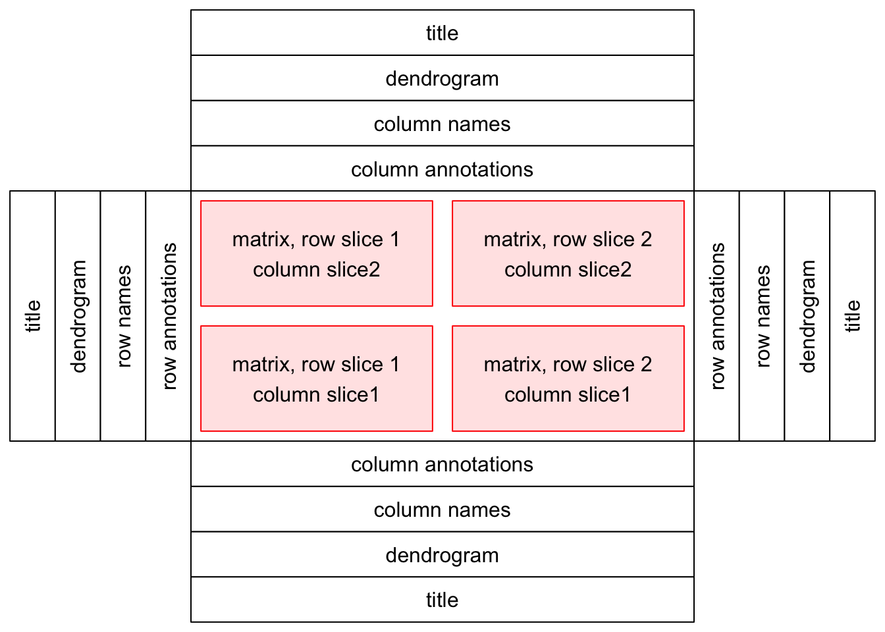
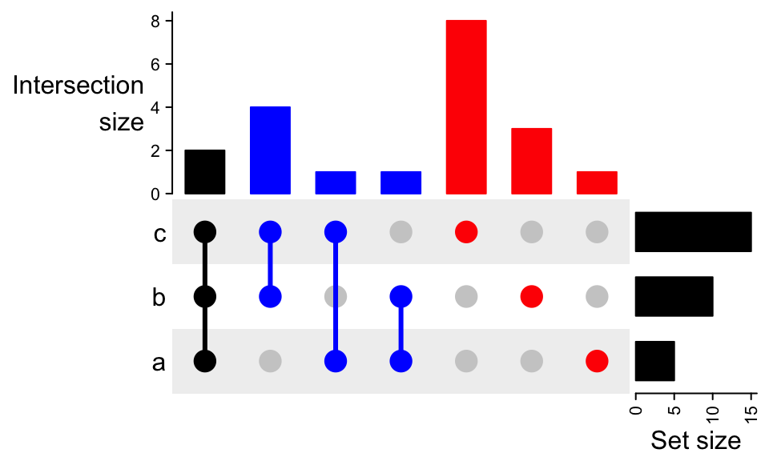
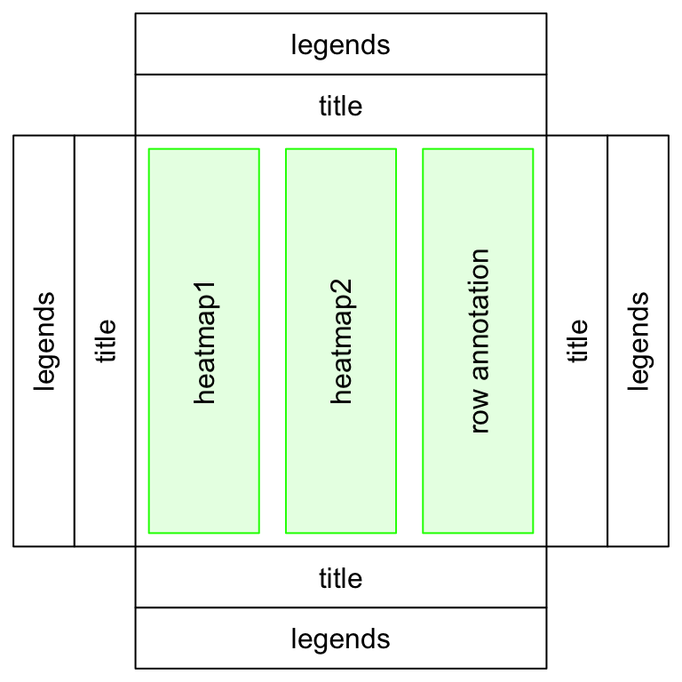
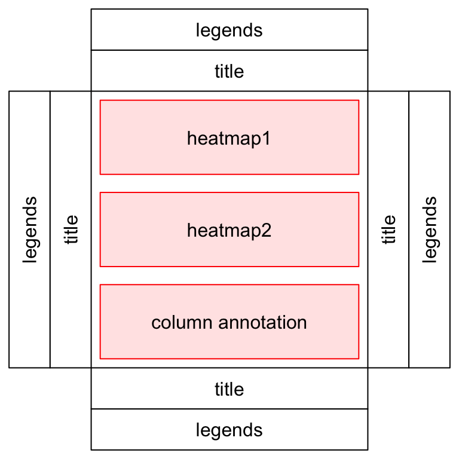

# Introduction

`ComplexHeatmap` is probably the most complex package for heatmap visualization.

- [Reference book](https://jokergoo.github.io/ComplexHeatmap-reference/book/)
- Paper:
  [Complex heatmaps reveal patterns and correlations in multidimensional genomic data](https://academic.oup.com/bioinformatics/article/32/18/2847/1743594)

Its design follows the object-oriented scheme, so heatmap body, annotations, legends etc. are self-contained building blocks.
It can do a lot and it can be a bit overhelming, but for simple heatmaps (e.g. z-score of logcounts), unlike `heatmap.2` and similar packages,
`ComplexHeatmap` is more user-friendly and provides you a great assistance.

{width=75%}

The basic classes are:

- `Heatmap`: a single heatmap containing heatmap body, row/column names, titles, dendrograms and row/column annotations.
- `HeatmapList`: a list of heatmaps and heatmap annotations.
- `HeatmapAnnotation`: defines a list of row annotations and column annotations.
  The heatmap annotations can be components of heatmap, also they can be independent as heatmaps.
- `AnnotationFunction`: a single annotation created by `anno_*()` functions (e.g. `anno_barplot()`).

---

`ComplexHeatmap` offers a wide variety of annotations.
[Here](https://jokergoo.github.io/ComplexHeatmap-reference/book/more-examples.html) are some examples of its capabilities:

](ComplexHeatmap_insertimage_10.png){width=75%}

](ComplexHeatmap_insertimage_5.png)

](ComplexHeatmap_insertimage_9.png)

: visualize multiple genomic alteration events.](ComplexHeatmap_insertimage_6.png)

](ComplexHeatmap_insertimage_11.png)

](ComplexHeatmap_insertimage_12.png)

: an efficient way to visualize intersections of multiple sets compared to the traditional approaches, i.e. the Venn Diagram.](ComplexHeatmap_insertimage_7.png){width=50%}

{width=50%}

---

`ComplexHeatmap` was primarily developed for omics data, for example to show correlations in expression and methylation data.
For that cases it offers the [`HeatmapList()`](https://jokergoo.github.io/ComplexHeatmap-reference/book/a-list-of-heatmaps.html) class.

{width=50%}

{width=50%}

](ComplexHeatmap_insertimage_4.png)

---

# Examples

```{r, message = FALSE, warning = FALSE}
library(ComplexHeatmap)
```

## Data preparation

Let's prepare a 10x10 matrix, sample sheet and color palette.
It's really weird, but if you let `ComplexHeatmap` to generate annotation colors automatically,
it assigns them randomly, so rather use your own color mapping.

```{r}
m <- matrix(
  c(
    # Sex: female
    rnorm(10, mean = 5),
    rnorm(10, mean = 4),
    # Sex: male
    rnorm(20, mean = 1),
    rnorm(20, mean = 2),
    rnorm(20, mean = 3),
    # Sex: unknown
    rnorm(10, mean = 10),
    rnorm(10, mean = 15)
  ),
  nrow = 10,
  ncol = 10
)
rownames(m) <- paste0("gene_", 1:nrow(m))
colnames(m) <- paste0("sample_", 1:ncol(m))
m_scaled <- t(scale(t(m)))
m_scaled

sample_sheet <- data.frame(
  Sex = c(rep("female", 2), rep("male", 6), rep("unknown", 2)),
  Treatment = c(rep("control", 4), rep("alcohol", 4), rep("coffeine", 2)),
  stringsAsFactors = TRUE
)
sample_sheet

# This is a default ggplot2 palette.
color_palette <- scales::hue_pal()(6)
color_palette
scales::show_col(color_palette)
```

Color mapping is similar to `ggplot2::scale_color_manual(values = c(...))`.
It's a list where values are named vectors of factor levels and names of the list values correspond to names of annotations.

```{r}
color_mapping <- list(Sex = color_palette[1:3], Treatment = color_palette[4:6])
names(color_mapping$Sex) <- levels(sample_sheet$Sex)
names(color_mapping$Treatment) <- levels(sample_sheet$Treatment)
color_mapping
```

## The most common heatmap

```{r}
p_heatmap_1 <- Heatmap(
  m_scaled,
  name = "z-score",
  show_row_names = TRUE,
  column_title = "Main column title",
  top_annotation = HeatmapAnnotation(Sex = sample_sheet$Sex, Treatment = sample_sheet$Treatment, col = color_mapping),
  heatmap_legend_param = list(legend_direction = "vertical")
)

draw(p_heatmap_1, merge_legend = TRUE)
```

By default, heatmap color legend is separated from annotation legends (it lies in separate column).
So to save space it is better to merge them, and for that you need to call the `draw()` method with `merge_legend = TRUE`.

## Split columns by sample groups

Alternatively you can split columns by defined groups and apply clustering within them:

```{r}
p_heatmap_2 <- Heatmap(
  m_scaled,
  name = "z-score",
  cluster_column_slices = FALSE,
  show_row_names = TRUE,
  column_title = "Main column title",
  column_split = sample_sheet$Sex,
  top_annotation = HeatmapAnnotation(Sex = sample_sheet$Sex, Treatment = sample_sheet$Treatment, col = color_mapping),
  heatmap_legend_param = list(legend_direction = "vertical")
)
draw(p_heatmap_2, merge_legend = TRUE)
```

## [Special annotations](https://jokergoo.github.io/ComplexHeatmap-reference/book/heatmap-annotations.html)

```{r}
p_heatmap_3 <- Heatmap(
  m_scaled,
  name = "z-score",
  cluster_column_slices = FALSE,
  show_row_names = TRUE,
  column_title = "Main column title",
  column_split = sample_sheet$Sex,
  top_annotation = HeatmapAnnotation(Sex = sample_sheet$Sex, Treatment = sample_sheet$Treatment, col = color_mapping),
  left_annotation = rowAnnotation(density = anno_density(m_scaled, joyplot_scale = 2, gp = gpar(fill = 1:10))),
  right_annotation = rowAnnotation(boxplots = anno_boxplot(m_scaled, width = unit(4, "cm"), gp = gpar(fill = 1:10))),
  heatmap_legend_param = list(legend_direction = "vertical")
)
draw(p_heatmap_3, merge_legend = TRUE)
```

You can see that this heatmap is similar to the second one (`p_heatmap_2`).
Almost everything you pass in parameters of `Heatmap()` constructor can be also modified in the existing heatmap object:

```{r, eval = FALSE}
p_heatmap_3@left_annotation <- rowAnnotation(density = anno_density(m_scaled, joyplot_scale = 2, gp = gpar(fill = 1:10)))
p_heatmap_3@right_annotation <- rowAnnotation(boxplots = anno_boxplot(m_scaled, width = unit(4, "cm"), gp = gpar(fill = 1:10)))
```

```{r, echo = FALSE, eval = FALSE, message = FALSE, warning = FALSE}
library(rmarkdown)
library(knitr)
library(glue)

opts_chunk$set(warning = FALSE, message = FALSE)
render("ComplexHeatmap.Rmd", output_file = "ComplexHeatmap.html")
```
