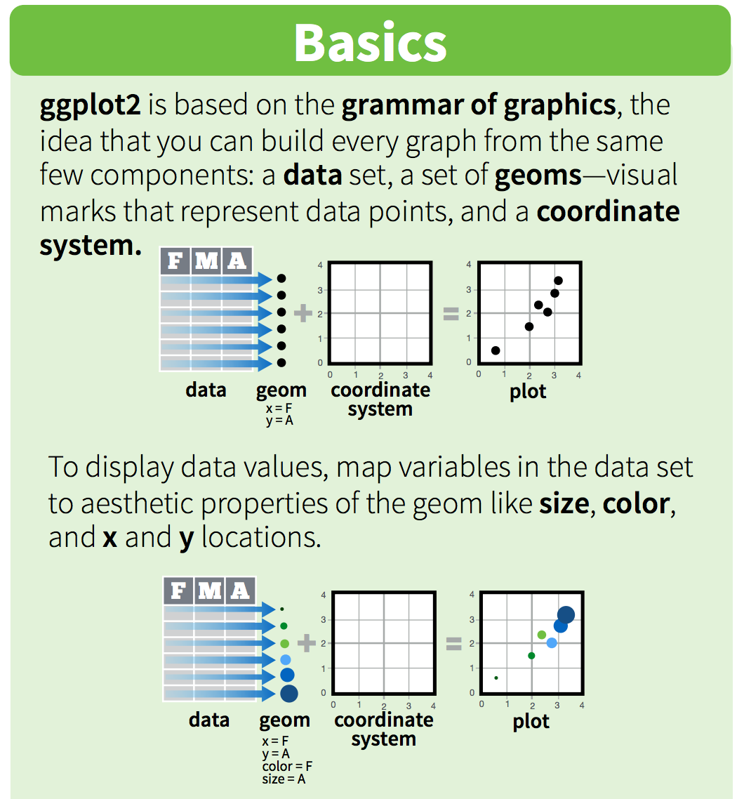

```{r, child = here("_assets/custom.Rmd"), eval = TRUE}
```

***

Copy, please, these files and directories to your personal directory:

```{bash, eval = FALSE}
cp -r ~/shared/AGE2021/Exercises/E02-intro_to_R ~/AGE2021/Exercises
```

Assignment for this exercise is located in `E02-intro_to_R/assignment`.

***

# RMarkdown

First you will learn how to use RMarkdown. Please, open `intro_to_Rmd.Rmd` in RStudio.
You can also open its rendered version `intro_to_Rmd.html` in your web browser.

***

# The must read sections

Take this material as an overview of good R techniques and packages.
It is quite long, but some sections are really necessary to go through, as we will utilize them in the following exercises and assignments:

- [Reproducible R](#reproducible-r)
  - [Project-oriented workflow](#project-oriented-workflow)
  - [Runtime-information](#put-runtime-information-to-the-end-of-your-scriptrmd-file)
  - [Do not automatically/reload your R session](#do-not-automatically-reload-your-r-session)
  - [Prevent package namespace conflicts](#prevent-package-namespace-conflicts)
    - You don't have to use the `conflicted` package described there, just be aware that a function name could be the same
      in different packages, and so using package prefixes (e.g. `dplyr::select()`) is the best way to avoid such conflicts.
- [Installing R packages](#installing-r-packages)
- [Writing your own functions](#writing-your-own-functions)
- [Try to utilize vectorized operations](#try-to-utilize-vectorized-operations)
- Introduction to tidyverse
  - Tidy (long) data
  - `magrittr`
  - `tibble`
  - `dplyr`
  - `tidyr`
  - `stringr`
  - `glue`
  - `ggplot2`
- [Other useful packages](#other-useful-packages)
  - `ComplexHeatmap`
  - `BiocParallel` - mainly to know what is `BPPARAM`

> Don't be just observers and try to modify the examples, so you will understand how things work! `r emo::ji("wink")`

***

# Reproducible R

Well, this could be a chapter on its own, but only a few **important** tips will be given,
basically to avoid things like [these](https://www.tidyverse.org/blog/2017/12/workflow-vs-script/):

](`r here("E02-intro_to_R/images/not_reproducible.png")`)

- `setwd("C:\Users\jenny\path\that\only\I\have")` will obviously work only on the computer of creator.
- `rm(list = ls())` will not perform the full restart of R, it will just remove user-defined objects.
  In addition, what if I accidentally run your script and it will remove a week of hard computations on my computer?

Almost all aspects of using R for reproducible research are summarized in [these slides](https://annakrystalli.me/talks/r-in-repro-research-dc.html#1).

## Project-oriented workflow

As you know, we have created the RStudio project for AGE exercises, with its top-level directory being `~/AGE2021/Exercises`
(you can find the `Exercises.Rproj` file there).
Whenever you open a project in RStudio, it will automatically set the working directory to its top-level.

Now that you have this information, you can think of "I will stop using `setwd()` and always use paths relative to top-level directory".
Unfortunately, some packages are evil and set your working directory silently, which leads to unexpected and hard-to-debug errors
(one example is `knitr` described in `intro_to_Rmd.Rmd`).
Luckily, for a consistent navigation in your projects, [here](https://github.com/jennybc/here_here) package was created.

Let's see how it works. The main function is `here::here()`:

```{r, warning = FALSE}
library(here)
here()
here("E02-intro_to_R", "images")
```

It joins paths relative (`E02-intro_to_R/images`) to the project's top-level directory with its absolute path (`r here()`).
But what happens if we change the working directory?

```{r, warning = FALSE, eval = FALSE}
# Just for educational purposes!
setwd("E01-intro")
cat("Current working directory:\n")
getwd()
```

```
Current working directory:
[1] "/data/persistent/jirinovo/bio-class-deb10/AGE2021/Exercises/E01-intro"
```

```{r, warning = FALSE, eval = FALSE}
cat("here():\n")
here()
```

```
here():
[1] "/data/persistent/jirinovo/bio-class-deb10/AGE2021/Exercises"
```

```{r, warning = FALSE, eval = FALSE}
cat("Some path:\n")
here("E02-intro_to_R", "images")
setwd(here())
```

```
Some path:
[1] "/data/persistent/jirinovo/bio-class-deb10/AGE2021/Exercises/E02-intro_to_R/images"
```

Hmm, nothing happened after `setwd()`, right? This way, no hidden `setwd()` can surprise you `r emo::ji("sunglasses")`

How is it possible `here` always knows where is the top-level of project located?
Well, `here` is smart: it scans your project directory structure and do some heuristics.
The most basic one is searching for file ending with `.Rproj`.
Wait! Is that one of the reasons why we have created our RStudio project? Yes, exactly `r emo::ji("nerd_face")`

If you want to save space and typing, you can also define variables with `here` paths and use them to construct paths relative to them:

```{r}
output_dir <- here("some/output/directory")
here(output_dir, "analysis_1")
```

You can find more information about project-oriented workflow [here](https://rstats.wtf/project-oriented-workflow.html)
and about safe `here` paths [here](https://www.tidyverse.org/blog/2017/12/workflow-vs-script/) and
[here](https://rstats.wtf/safe-paths.html).

## Put runtime information to the end of your script/Rmd file

It is a good practice to do so for the sake of reproducibility. This code outputs all important information about your R session
(see the [Cleanup](#cleanup) section for actual rendered output):

- Warnings.
- Traceback of errors.
- Loaded packages and their versions, external libraries (BLAS etc.).

```{r, eval = FALSE, warning = TRUE, message = TRUE}
warnings()
traceback()
sessionInfo()
```

Instead of `sessionInfo()` you can utilize the `sessioninfo` package, which offers a prettier output:

```{r, eval = FALSE}
sessioninfo::session_info()
```

## Do not automatically reload your R session

Otherwise you can expect the unexpected.

](https://rstats.wtf/img/rstudio-workspace.png)

> Because you are using R through RStudio Server, don't worry when you close your browser - R session will remain running.

## Prevent package namespace conflicts

When you load a package with `library()`, all exported objects from that packages are attached to the global namespace, while replacing existing objects.
Let's see an example (restart your R session before). Function named `select()` is very common, for example it is present in these two packages:

```{r}
AnnotationDbi::select
dplyr::select
```

If we use package prefix to locate the `select()` function (`AnnotationDbi::` or `dplyr::`), no problems can arise.

But see what happens when we load these two packages:

```{r, message = FALSE, eval = FALSE}
library(AnnotationDbi)
library(dplyr)
select
```

```
function (.data, ...) 
{
    UseMethod("select")
}
<bytecode: 0x5558f010cba8>
<environment: namespace:dplyr>
```

You see that `select()` from `dplyr` won, because this package was loaded after `AnnotationDbi`.
This could lead to unexpected results: you think you are using a function from a package, but instead you are using a function with the same name,
but from an another package, which was loaded last.

To prevent such confusions, we can use the [conflicted](https://github.com/r-lib/conflicted) package.
It is a sort of guardian and dictator in one person: it throws error when you attempt to use a function with ambiguous name,
and also allows you to select a preferred package for such conflicts. Let's see it in action (restart your R session again):

```{r, message = FALSE, eval = FALSE}
library(conflicted)
library(AnnotationDbi)
library(dplyr)
select()
```

```
Error: [conflicted] `select` found in 2 packages.
Either pick the one you want with `::` 
* dplyr::select
* AnnotationDbi::select
Or declare a preference with `conflict_prefer()`
* conflict_prefer("select", "dplyr")
* conflict_prefer("select", "AnnotationDbi")
Run `rlang::last_error()` to see where the error occurred.
```

You see that `select` is conflicting and `conflicted` offers you two options how to resolve it:

- Use the package prefix:

```{r, eval = FALSE}
dplyr::select
```

- Or use `conflict_prefer()` to select a preferred package:

```{r, eval = FALSE}
conflict_prefer("select", "dplyr")
select
```

```
[conflicted] Will prefer dplyr::select over any other package

function (.data, ...) 
{
    UseMethod("select")
}
<bytecode: 0x56350f4713e8>
<environment: namespace:dplyr>
```

> `conflicted` should be loaded as the first package.

> Unfortunately, I encountered some RStudio freezes during the usage of `conflicted`.
  In that case refer to the section "What to do when RStudio is stuck" in E01-intro.

Alternatively, the following packages offer a clearer mechanism of package loading.
They allow to import only specific objects from a package, similar to Python's `from package import function as fn`

- [box](https://klmr.me/box/)
- [import](https://import.rticulate.org/)

***

## Use [renv](https://rstudio.github.io/renv/index.html) to capture your project dependencies

This is really not needed for AGE, but anyway it is a good practice to somehow export all packages needed to run your project,
and [renv](https://rstudio.github.io/renv/index.html) is a great tool for that. It basically does two things:

- Creates a separate R library for your project. This way, all packages are installed into this library instead of the system one.
  So when some project needs a particular package version, you won't mess up your system library.
- It searches your project files for `library()` and `package::` usages and exports packages with exact versions to a file called `renv.lock`.
  Based on this file, everyone is able to install all packages needed for a project.

`renv` is somehow similar to virtual environments in `conda` `r emo::ji("slightly_smiling_face")`

***

## Use [targets](https://docs.ropensci.org/targets/): a Make-like pipeline toolkit for R

> The `targets` package is a Make-like pipeline toolkit for statistics and data science in R.
  With `targets`, you can maintain a reproducible workflow without repeating yourself.
  `targets` skips costly runtime for tasks that are already up to date, runs the necessary
  computation with implicit parallel computing, and abstracts files as R objects.
  A fully up-to-date `targets` pipeline is tangible evidence that the output aligns with the code and data, which substantiates trust in the results.

This is really out of scope of AGE, but [targets](https://docs.ropensci.org/targets/) is the way reproducible R analyses should be done.

***

# Installing R packages

For bioinformatic purposes we will be using packages from [Bioconductor](http://bioconductor.org/), which
groups together packages for bioinformatics.
There are several core packages developed by Bioconductor's team which
share the same philosophy (API) and are used by other third-party packages.
For example, [SummarizedExperiment](https://bioconductor.org/packages/release/bioc/html/SummarizedExperiment.html)
is used for storing experiment data (expression matrix, phenotype data, genomic ranges).

Bioconductor packages are installed through `BiocManager::install()` function.
However, because some Bioconductor packages can interefere with packages from R main repository
[CRAN](https://cran.r-project.org/), always use `BiocManager::install()` to install packages,
regardless their source repository.

It is also possible to install packages from GitHub repository with `BiocManager::install("user/repository")`, for example
`BiocManager::install("tidyverse/stringr")`. `BiocManager` recognizes `/` as a GitHub source and uses
`devtools::install_github()` underneath.

If you run `BiocManager::install()`, it will detect outdated packages and ask you whether to update them.
However, some of them are system-wide and must be installed from R running with root privileges, see below.

If you install a package from R session launched from user shell (that is the R session in RStudio),
it will be installed to your personal library in home directory.
However, some packages must be installed to system library (usually the base R packages like `Matrix`),
so you need to run R as root user from terminal (`sudo R`) and then install/update packages.

***

# Debugging R code

Because R has dynamic typing and its error tracing is not as good as in e.g. Python, its debugging
could be very painful. Here are some tips for saving your mental health (or refer to [this](https://adv-r.hadley.nz/debugging.html)):

## `traceback()`

When error occurs, its message is usually not very informative.
`traceback()` function prints a call stack of last error,
helping you to resolve a location of the error.

Let's define the group of functions, which call each other, starting from `f()`:

```{r}
f <- function(x) g(x)
g <- function(y) h(y)
h <- function(z) {
  z**2
}
```

Now we can try calling `f()`. It will fail for `"2"`, obviously:

```{r, error = TRUE}
f(2)
f("2")
```

We can inspect the call stack:

```{r, eval = FALSE}
traceback()
```

```
3: h(y) at <text>#2
2: g(x) at <text>#1
1: f("2")
```

Also try running `f("2")` in your prompt.
RStudio will directly offer you to show traceback or rerun code with debug (see below).

## Interactive debugger

Sometimes you need more information from a location of error.
Interactive debugger allows you to pause execution of a function and interactively explore its state.
It is invoked by calling the `browser()` function:

```{r, eval = FALSE}
f2 <- function(x) g2(x)
g2 <- function(y) h2(y)
h2 <- function(z) {
  browser()
  z**2
}

f2("2")
```

Interactive debugger can be also invoked by RStudio, as is shown above in the `traceback()` section.

> Unfortunately, `browser()` is not working well from within code chunks,
  so rather run debugged function from the R command line (interactive session).

## `recover()`

Another way to activate `browser()` is to use `options(error = recover)`.
Now when you get an error, you will get an interactive prompt that displays the
traceback and gives you the ability to interactively debug inside any of the frames:

```{r, eval = FALSE}
options(error = recover)
f("2")
```

To restore the default on-error behaviour, use `dump.frames`:

```{r, eval = FALSE}
options(error = dump.frames)
```

***

# Writing your own functions

Functions are the essential part of every programming language and you should already know how to write your own, so this will be just a quick overview.

A rather simplistic view defines functions as repeatable, (parametric) block of code which returns something.
Let's define the most basic function, which doesn't have any arguments and doesn't return anything:

```{r, message = TRUE}
fn <- function() {
  message("Hello world!")
}
fn()
```

Let's add a return value:

```{r}
fn2 <- function() {
  return("Hello world!")
}
out <- fn2()
out
```

Function will return the last value, so this is equivalent:

```{r, eval = FALSE}
fn2 <- function() {
  "Hello world!"
}
```

However, the difference is that `return()` will immediately exit the function.

Now we add some arguments:

```{r}
fn3 <- function(x, y = 2) {
  return(x * y)
}
fn3(2)
fn3(2, y = 5)
```

Functions can have required arguments (in our case `x`) and optional arguments with default values (`y = 2`).

If you want to return multiple values, you can use `list()` or similar data type:

```{r}
fn4 <- function(x, y = 2) {
  out <- list(x * y, x + y)
  return(out)
}
fn4(3)
```


An important concept is function scope, which defines which variables can function access.
Function can see variables in environment from which it was called.
In this example, `fn4()` can see `y` defined in global environment:

```{r}
fn5 <- function(x) {
  return(x * y)
}
y <- 3
fn5(2)
```

However, functions cannot modify variables outside of their scope (besides global variables, but rather don't use them).
Let's try to modify `y` within `fn5()`:

```{r}
fn6 <- function(x) {
  y <- 5
  return(x * y)
}
y <- 3
fn6(2)
y
```

You can see that by `y <- 5` we only created a local variable `y` - the `y` from outer scope wasn't modified.

As you will see in the next section, functions can be also anonymous, i.e. they are not assigned to any variable and just used once, just like that:

```{r, eval = FALSE}
function(x) {
  x ** 2
}
```

***

# Try to utilize vectorized operations

R's fundamental feature is vectorization. All basic data types (`numeric`, `character`, etc.) are vectors and most of base functions are vectorized,
including basic arithmetic operators:

```{r}
(my_vector <- 1:5)
my_vector + 5
my_vector * 2
```

So for example, for-loops like this are unnecessary in R:

```{r}
my_vector <- 1:2e6

system.time({
  results <- list()
  for (i in my_vector) {
    results[[i]] <- my_vector[i] + 1
  }
})
```

Compared to that, `lapply()` is much more faster: 

```{r}
rm(results)
system.time({
  results <- lapply(my_vector, function(x) x + 1)
})
```

Anyway in this sort of dumb example, you should use the vectorized addition operation instead:

```{r}
system.time(my_vector + 1)
```

Generally, rather try to avoid for-loops, because:

**For-loops have side effects**

- They leave iterating variable in environment. From the example above, the variable `i` still has value of the last element of `my_vector`: `r i`
- They can change other variables from within the loop, which could lead to hard to find bugs.

**For-loops could be slow**

Those are mostly cases when in each loop you add something new to a vector or matrix, which, then,
needs to be re-sized, causing a re-allocation of memory.
Two great posts on this topic are [here](https://privefl.github.io/blog/why-loops-are-slow-in-r/) and
[here](http://www.noamross.net/archives/2014-04-16-vectorization-in-r-why/) (chapter 4).
  
Taking into account the pre-allocation of output list, we can rewrite the for-loop above as:
  
```{r}
system.time({
  results <- vector(mode = "list", length = length(my_vector))
  for (i in my_vector) {
    results[[i]] <- my_vector[i] + 1
  }
})
```

Now it is even faster than `lapply()` `r emo::ji("astonished_face")`.
But as you can see, you have to take care of pre-allocation, which is something apply-family functions are doing for you (see below).

**For-loops cannot be easily parallelized**

There are several packages, which offer an easy parallelization of apply-family functions (see below).

So, what to use in R instead of for-loops?

## Vectorized functions

Some examples of vectorized functions other than arithmetic ones:

```{r}
my_vector <- 1:5
mean(my_vector)
sum(my_vector)
cumsum(my_vector)
ifelse(my_vector < 2, "< 2", ">= 2")
```

Some functions operating on matrix row or column vectors:

```{r}
head(USArrests)
colSums(USArrests)
rowMeans(USArrests)
```

## Apply-family functions

These functions take data (vector, list, dataframe, ...) as an input and apply a function on each of its element.
Let's introduce the most basic ones:

`sapply()` apply a function to each element of a vector or list and returns a vector:

```{r}
sapply(my_vector, function(x) {
  x ** 2
})
```

`lapply()` is similar, but returns a list instead of vector.
It can be also used for dataframes, where a function is applied to each of dataframe's column (dataframe is basically a list of column-lists):

```{r}
lapply(my_vector, function(x) {
  x ** 2
})

lapply(mtcars, head)
```

`apply()` takes as an input dataframe or matrix and applies a function on either rows or columns, returning a single value for each of them.
Row-apply and column-apply are specified by `MARGIN` parameter: `1` for rows and `2` for columns.

```{r}
apply(mtcars, MARGIN = 1, mean)
apply(mtcars, MARGIN = 2, mean)
```


### Parallelization

There are several packages offering parallelization of common apply-family functions,
for example [parallel](https://www.rdocumentation.org/packages/parallel) (part of base R),
[doParallel](https://cran.r-project.org/web/packages/doParallel/index.html),
[future.apply](https://cran.r-project.org/web/packages/future.apply/index.html) or
[BiocParallel](https://bioconductor.org/packages/release/bioc/html/BiocParallel.html)
(described in more detail in [this](#biocparallel) section).

Just a brief example of parallel `lapply()` using two CPU cores:

```{r, eval = FALSE}
parallel::mclapply(my_vector, mc.cores = 2, FUN = function(x) {
  x ** 2
})
```

Quite the same code as for `lapply()`, right? Just be aware that parallelization doesn't always bring you
the desired speedup, because first, computation environments have to be setup.
In short, objects need to be copied to a new thread or R process and that brings some overhead.

***

# Introduction to [tidyverse](https://www.tidyverse.org/)

Until now you have been probably using only the base R.
[Tidyverse](https://www.tidyverse.org/) can be seen as a dialect of R and is described as follows:

> The `tidyverse` is an opinionated collection of R packages designed for data science.
  All packages share an underlying design philosophy, grammar, and data structures.

`Tidyverse` is very popular these days, but as some ([here](https://github.com/matloff/TidyverseSkeptic)
and [here](http://r4stats.com/2017/03/23/the-tidyverse-curse/)) have noted,
it is not suitable for R beginners, meaning you should first know how base R is working and only then learn `tidyverse`.

**Useful links**

- [List of tidyverse packages](https://www.tidyverse.org/packages/)
- [R for Data Science](https://r4ds.had.co.nz/) - an amazing tutorial book for R which is mainly using `tidyverse`.
- [**Awesome list of cheatsheets**](https://rstudio.com/resources/cheatsheets/).
  Some of them are also accessible in RStudio: `Help -> Cheatsheets`

## Tidy (long) data

`Tidyverse` packages are not meant to replace the base R.
Especially, they are not suited for matrix manipulation, and are specifically used for **long data**
(also called **tidy data**). More about tidy data can be found [here](https://r4ds.had.co.nz/tidy-data.html).

The following three rules make a dataset tidy:

- Each variable must have its own column.
- Each observation must have its own row.
- Each value must have its own cell.

`)

As you will see, we will be mostly working with biological matrices (= data in **wide** format).
For example, consider this datafame:

```{r}
(df_wide <- data.frame(sample_1 = 1:2, sample_2 = 3:4, sample_3 = 5:6, row.names = c("gene_A", "gene_B")))
```

For each sample (column) and each gene (row) we have its value (cell).
This form of data is usable for functions operating on matrices (e.g. PCA), but as you will see later, not for e.g. plotting
(besides base R plotting).

This dataframe is wide, and thus it is not tidy.
You can see that rownames and colnames are, in fact, values of variables `Gene` and `Sample`, respectively.
So how would this dataframe look like in tidy format? Don't be surprised now, we will get to this code later.

```{r}
library(magrittr)
library(tidyverse)

df_long <- df_wide %>%
  tibble::rownames_to_column("Gene") %>%
  tidyr::pivot_longer(-Gene, names_to = "Sample", values_to = "Count")
df_long
```

Now `df_long` is tidy and corresponds to long format of the original dataframe.
We actually did this:

`)

Why is long data useful for some purposes (mainly for plotting)?
Well, for biological matrix like the one in `df`, you usually also have a sample sheet, for example:

```{r}
(sample_sheet <- data.frame(Sample = c("sample_1", "sample_2", "sample_3"), Age = 1:3, Treatment = c("yes", "no", "yes")))
```

Would it be neat to have this information alongside the long data (`df_long`)?
I think so:

```{r}
dplyr::left_join(df_long, sample_sheet, by = "Sample")
```

**As you will see later, this long form of data is extremely useful for plotting.**
In this blog [post](http://varianceexplained.org/r/tidy-genomics/), there is a nice example of using tidy data and `tidyverse` in genomics.

## Non-standard evaluation (NSE)

Let's go ahead a bit and look at this `select()` function from `dplyr` package (will be introduced later):

```{r}
dplyr::select(mtcars, cyl, mpg) %>% head()
```

You can see that `select()` is filtering columns of a dataframe.
But it has a strange syntax, hasn't it? We have used variables, which are not defined in our current environment.
Don't be scared by this dark magic - it is based on R's [lazy evaluation](https://colinfay.me/tidyeval-1/)
([details](https://www.r-bloggers.com/about-lazy-evaluation/))
and it is called **[non-standard evaluation](https://tidynomicon.tech/nse.html)** (NSE).
**In short, R only evaluates the expression if the expression is actually used.**
Just a quick example:

```{r}
my_fn <- function(x, y, z) {
  print("Hello!")
}

my_fn(a, b, c)
```

You can see we are passing non-existent variables `a`, `b` and `c` to `my_fn()`, but no errors are thrown!
That is because R is evaluating variables (or more generally expressions) only when needed (i.e. lazily).

Also R has quite advanced metaprogramming abilities, so inside a function, we can do things like:
"Get the name (symbol) of variable, which was passed to the function.".
So for example, you can find out that you passed
variable named `a` as the argument `x` and expression `mean(b)` as the argument `y`:

```{r}
my_fn <- function(x, y, z) {
  print(substitute(x))
  print(substitute(y))
}

my_fn(a, mean(b), c)
```

Magic! `r emo::ji("man_mage")`

This is very roughly how most `tidyverse` functions work. They are using NSE to look first at variables inside a passed object (columns = variables).
Most of these functions are designed to have their first parameter as data object.
When variables are not found inside the object, function will look for variables in the global environment
(this can cause unwanted problems, when object has variable with the same name as the one in global environment).
So in the example above, `cyl` and `mpg` variables are evaluated in the context of `mtcars` object and environment
defined in `select()` function call.

Of note, there are some base R functions which also use NSE. Some examples:

```{r}
cyl2 <- with(mtcars, {cyl ** 2})
head(cyl2)
subset(mtcars, hp < 90)
```

NSE is a quite advanced topic and its knowledge is mainly needed for implementation of custom functions, which share the `tidyverse` philosophy.
See `vignette("programming")` and [friendlyeval](https://github.com/MilesMcBain/friendlyeval),
a friendly interface for NSE programming.

Now we will quickly look at the most popular `tidyverse` packages.

***

## [magrittr](https://magrittr.tidyverse.org/) - a pipe operator

The pipe operator is probably the basic compound of shell programming.
Fortunately for us, it is also implemented in R package [magrittr](https://magrittr.tidyverse.org/).

> The pipe operator will become an [official part of the R](https://michaelbarrowman.co.uk/post/the-new-base-pipe/) in the next version 4.1.0!
  Anyways, besides a bit worse performance, `magrittr` will still offer more flexibility.

The pipe operator (see <code>?&grave;%>%&grave;</code>) is forwarding output from the left hand side (LHS) to input on the right hand side (RHS).
The default behaviour is to pipe output to the first argument of a RHS function.

So instead of using nested functions like

```{r}
head(rownames(mtcars))
```

you can use the pipe operator:

```{r}
rownames(mtcars) %>% head()
```

And there are even [more types of pipes](https://magrittr.tidyverse.org/reference/index.html).

Piped object is available on the RHS as the `.` object.
It is used when you want:

- To use an argument different than first of the RHS function:

```{r}
c("first", "second", "third") %>% paste("I am", ., sep = " ")
```

- To use the LHS output as a regular R object:

```{r}
mtcars %>% .$cyl
mtcars %>% .[1:5, 1:3]
```

- To use a lambda expression, which behaves like a function with a single parameter `.`.
  Don't wrap your head around - just wrap an expression on the RHS to `{}` if you need to use nested functions, e.g. `mtcars %>% {head(rownames(.))}`

```{r}
mtcars %>% {head(.$cyl)}
mtcars %>% {
  my_data <- .
  c(min(my_data), max(my_data))
}
```

Or you can define an anonymous function:

```{r}
mtcars %>% (function(my_data) c(min(my_data), max(my_data)))
```

Using arithmetic and other operators together with pipe can be more pleasant with provided [aliases](https://magrittr.tidyverse.org/reference/aliases.html).

Add and subtract operators are working fine:

```{r}
1 %>% + 2 %>% - 3
```

But for the sake of consistency, rather use operator aliases:

```{r}
1 %>% add(2) %>% subtract(3)
```

It is not possible to use some operators without aliases, e.g. `==` or `*`:

```{r, error = TRUE}
1 %>% == 2
1 %>% * 3
```

```{r}
1 %>% equals(2)
1 %>% multiply_by(3)
```

> In fact, operators are called [infix functions](https://colinfay.me/playing-r-infix-functions/) and all aliases are actually shorthands
  for writing operators as "classic" functions, e.g. <code>&grave;*&grave;(x, y)</code>. So the examples above can be also written as:

```{r}
1 %>% `==`(2)
1 %>% `*`(3)
```

But rather don't do that `r emo::ji("smile")`

***

## [tibble](https://tibble.tidyverse.org/) - an enhanced data.frame

There are some differences between [tibble](https://tibble.tidyverse.org/) and base R `data.frame`
(see link above and examples [here](https://r4ds.had.co.nz/tibbles.html)),
but the most visible difference is in printing of a tibble:

```{r}
tibble::as_tibble(mtcars)
```

`tibble` is showing the data types of variables. Also you can see that there aren't rownames -
this is strange, but it is one of the features of `tibble`.
Authors of `tibble` package are convinced that rownames should be represented by variable (column) and
not by object's attribute, accessible by `rownames()` method.

**This is bad particularly for usage of `tidyverse` together with Bioconductor, where
rownames are an essential component.**
Many tidyverse functions return a `tibble` or drop rownames, but most of times we rather want `data.frame`
with defined rownames.
`tibble` can be converted to a `data.frame` by `as.data.frame()` function.

**To preserve rownames in a new column, use the `tibble::rownames_to_column("name_of_new_column")` function.**

Useful is the `tribble()` function for more readable creation of (small) tables in code:

```{r}
my_tibble <- tibble::tribble(
  ~column_A, ~column_B,
  "a",   1,
  "b",   2,
  "c",   3
)
my_tibble
```

`tibble` is also useful for handling of nested `data.frame`-like objects or lists:

```{r}
my_tibble$column_C <- list(LETTERS, LETTERS, LETTERS)
my_tibble$column_D <- list(mtcars, mtcars, mtcars)
my_tibble
my_tibble$column_C[[1]]
head(my_tibble$column_D[[1]])
```

***

## [dplyr](https://dplyr.tidyverse.org/) - data manipulation

[dplyr](https://dplyr.tidyverse.org/) is probably the most popular package from `tidyverse.`
It helps to solve the most common data manipulation challenges and
its sibling [dbplyr](https://dbplyr.tidyverse.org/articles/dbplyr.html)
also supports remote data stored in a database (MySQL, PostreSQL, SQLite, and others).

Some functions in `dplyr` have names similar to functions from other packages.
**Thus, it is recommended to always specify the `dplyr::` namespace.**

- [Cheatsheet](https://raw.githubusercontent.com/rstudio/cheatsheets/master/data-transformation.pdf)

We will use a shortened `mtcars` dataset for examples:

```{r}
mtcars_sm <- head(mtcars)
```

### [select()](https://dplyr.tidyverse.org/reference/select.html) - select (filter) columns

```{r}
dplyr::select(mtcars_sm, cyl, mpg)
```

By using `-` you can also specifify columns to **omit**:

```{r}
dplyr::select(mtcars_sm, -cyl, -mpg)
```

We can select a range of variables. Numerical range is also supported, e.g. `1:5`.
Omitting a range is also possible - in this example you would use `-(disp:drat)`.

```{r}
dplyr::select(mtcars_sm, disp:drat)
```

There are also very useful [select helpers](https://tidyselect.r-lib.org/).
For column omitting they can be also combined with `-`.

Select columns starting with "c":

```{r}
dplyr::select(mtcars_sm, starts_with("c"))
```

Select columns containing "ar":

```{r}
dplyr::select(mtcars_sm, contains("ar"))
```

Select column at `last - 1` position:

```{r}
dplyr::select(mtcars_sm, last_col(1))
```

Select columns having names in vector and don't throw error on non-existing column:

```{r, warning = TRUE}
dplyr::select(mtcars_sm, one_of(c("mpg", "cyl", "garbage")))
```

Because this will fail:

```{r, error = TRUE}
dplyr::select(mtcars_sm, mpg, cyl, garbage)
```

`select()` can also select and rename columns at the same time:

```{r}
dplyr::select(mtcars_sm, cylinders = cyl, horse_power = hp)
```

To only rename specific and keep other columns, use `rename()` function:

```{r}
dplyr::rename(mtcars_sm, cylinders = cyl, horse_power = hp)
```

Using the `everything()` select helper also works, but you will lose the original column order:

```{r}
dplyr::select(mtcars_sm, cylinders = cyl, horse_power = hp, everything())
```

`select()` always returns an object of the same type as input.
However, sometimes you rather need a vector: `pull()` returns a vector of specified variable.

```{r}
dplyr::pull(mtcars_sm, cyl)
```

### [arrange()](https://dplyr.tidyverse.org/reference/arrange.html) - order rows

`arrange()` orders rows by specified variables.

```{r}
dplyr::arrange(mtcars_sm, cyl, disp)
```

Use `desc()` or `-` for descending order:

```{r, results = "hold"}
dplyr::arrange(mtcars_sm, desc(cyl))
# or
# dplyr::arrange(mtcars_sm, -cyl)
```

### [filter()](https://dplyr.tidyverse.org/reference/filter.html) - filter rows

In fact, `filter()` is very similar to base R function `subset()`, but offers much more functionality.

Multiple arguments are equivalent to AND operator:

```{r}
dplyr::filter(mtcars_sm, hp > 100, cyl == 6)
```

So this is equivalent:

```{r}
dplyr::filter(mtcars_sm, hp > 100 & cyl == 6)
```

Similarly, we can use other logical operators, e.g. OR:

```{r}
dplyr::filter(mtcars_sm, hp > 100 | cyl == 6)
```

Thanks to NSE we can do some magic. Here, we want rows where `hp` is greater than mean value of `hp` minus `10`:

```{r}
dplyr::filter(mtcars_sm, hp > mean(hp) - 10)
```

### [mutate()](https://dplyr.tidyverse.org/reference/mutate.html) - add new or modify existing variables

Named parameters of `mutate()` function create new variables (or modify existing, if a parameter name is same).

```{r}
tibble::rownames_to_column(mtcars_sm, "car_name") %>%
  dplyr::mutate(cyl2 = cyl * 2) %>%
  dplyr::select(car_name, cyl, cyl2)
```

`mutate()` is one of the `tidyverse` functions, which silently drop rownames.
To preserve them, we have moved rownames to the new column `car_name`.

This is how we remove the column and modify the existing one:

```{r}
dplyr::mutate(mtcars_sm, mpg = NULL, cyl = cyl * 2)
```

Very useful are these vectorized if functions:

[if_else()](https://dplyr.tidyverse.org/reference/if_else.html) checks for a condition and returns values for `TRUE` and `FALSE` matches.
In `missing` parameter you can also specify a return value for `NA` values.
`if_else()` is similar to base R `ifelse()`, but checks for the same return types.

```{r}
dplyr::mutate(mtcars_sm, car_category = if_else(hp >= 100, "strong", "weak")) %>%
  dplyr::select(hp, car_category)
```

You can see that return values must have the same type:

```{r, error = TRUE}
dplyr::mutate(mtcars_sm, car_category = if_else(hp >= 100, "strong", 50)) %>%
  dplyr::select(hp, car_category)
```

[case_when()](https://dplyr.tidyverse.org/reference/case_when.html) allows to specify multiple `if` statements.
Statements are given in a format `condition ~ return_value` and they are matched from first to last.

For `else` statement put `TRUE ~ some_value` as the last statement (if not specified, `some_value` will be `NA`).
As `case_when()` is checking for return types, you have to use appropriate `NA` type:
`NA_integer_`, `NA_real_`, `NA_complex_` or `NA_character_`.
Be careful since `1` is a real number (`double` type), whereas `1L` is a true integer.

```{r}
dplyr::mutate(
  mtcars,
  car_category = case_when(
    hp < 80 ~ "weak",
    hp >= 80 & hp <= 100 ~ "middle",
    hp > 100 ~ "strong"
  )
) %>%
  dplyr::select(hp, car_category)
```

[recode()](https://dplyr.tidyverse.org/reference/recode.html) replaces values, similar to `switch()`.
You can specify default return value for not-specified and `NA` values (`.default` and `.missing` parameters).
Very useful for replacing factor values while preserving their order.

```{r}
dplyr::mutate(mtcars_sm, am_char = recode(am, `0` = "zero", `1` = "one")) %>%
  dplyr::select(am, am_char)
```

[recode_factor()](https://dplyr.tidyverse.org/reference/recode.html) create factors with levels ordered as they appear in the recode call.

```{r}
factor(mtcars_sm$am) %>%
  levels()

dplyr::mutate(
  mtcars_sm,
  am = factor(am),
  am_char = recode_factor(am, `1` = "one", `0` = "zero")
) %>%
  dplyr::pull(am_char) %>%
  levels()
```

You can notice that mutate() parameters are evaluated from first to last.
So to `am_char` is already passed `am` as factor, as `am` is mutated before `am_char`.

Of course, all these functions can be also used for vectors:

```{r}
v <- c(1, 1, 2, 3, 10)
if_else(v < 2, "< 2", ">= 2")
```

```{r}
(am_factor <- factor(mtcars_sm$am))
recode(am_factor, `0` = "zero", `1` = "one")
recode_factor(am_factor, `1` = "one", `0` = "zero")
```

### [group_by()](https://dplyr.tidyverse.org/reference/group_by.html) and [summarise()](https://dplyr.tidyverse.org/reference/summarise.html)

`group_by()` is similar to SQL operation of the same name.
It takes an existing dataframe and converts it into a grouped dataframe where operations are performed "by group".

```{r}
by_cyl <- dplyr::group_by(mtcars, cyl)
by_cyl
```

Better is to see the original `tibble` in your console, where is information about groups.

Now we can perform operations on groups.
`summarise()` reduces multiple values down to a single value.
Let's calculate some statistics in the `cyl` groups:

```{r}
dplyr::summarise(
  by_cyl,
  n = n(),
  mpg_mean = mean(mpg),
  hp_max = max(hp),
  qsec_median = median(qsec),
  wt_sd = sd(wt)
)
```

[n()](https://dplyr.tidyverse.org/reference/n.html) is a special function to get counts inside groups:

`filter()` is now acting on groups. Let's compare these two filter operations:

```{r}
dplyr::filter(mtcars, mpg > mean(mpg))
dplyr::filter(by_cyl, mpg > mean(mpg))
```

The former keeps rows with `mpg` greater than the global average whereas the latter acts within the `cyl` groups, and, thus,
keeps rows with `mpg` greater than the average inside the `cyl` groups.

To remove grouping, use the `ungroup()` function.

### [*_join()](https://dplyr.tidyverse.org/reference/join.html) and [bind_rows()](https://dplyr.tidyverse.org/reference/bind.html) - joining dataframes

A collection of `*_join()` functions acts in the same way as in SQL -
based on common keys, they join two dataframes together.

See [these beautiful animations of joins](https://www.garrickadenbuie.com/project/tidyexplain/#mutating-joins)
and [this chapter](https://r4ds.had.co.nz/relational-data.html) in R for Data Science for more explanation.

```{r}
mtcars_prices <- tibble::tribble(
  ~cyl, ~price,
  4,    1000,
  6,    5000,
  8,    10000
)

dplyr::left_join(mtcars_sm, mtcars_prices, by = "cyl") %>%
  dplyr::select(cyl, price)
```

[bind_rows()](https://dplyr.tidyverse.org/reference/bind.html) appends rows to a dataframe. It puts `NA`s to columns not present in both dataframes.

```{r}
dplyr::bind_rows(mtcars_sm, mtcars_prices) %>%
  dplyr::select(cyl, price, everything())
```

***

## [tidyr](https://tidyr.tidyverse.org/) - tools for tidy data

The goal of [tidyr](https://tidyr.tidyverse.org/) is to help you to create [tidy data](https://tidyr.tidyverse.org/articles/tidy-data.html).
Just to remind you, tidy data is data where:

- Every column is variable.
- Every row is an observation.
- Every cell is a single value.

[Cheatsheet](https://github.com/rstudio/cheatsheets/blob/master/data-import.pdf) on reading and tidying data.

Let's look at some of basic tasks `tidyr` can do:

### Pivotting

[Pivotting](https://tidyr.tidyverse.org/articles/pivot.html) converts between long and wide forms.
We will reuse the wide `df_wide` dataframe.

[pivot_longer()](https://tidyr.tidyverse.org/reference/pivot_longer.html) "lengthens" data,
increasing the number of rows and decreasing the number of columns.

```{r}
df_wide

df_long <- df_wide %>%
  tibble::rownames_to_column("Gene") %>%
  tidyr::pivot_longer(-Gene, names_to = "Sample", values_to = "Count")
df_long
```

We have added rownames of `df_wide` to the new column `Gene`.
In `pivot_longer()` we specified by `-Gene` we want to lengthen all other columns.

Of course more than one column can be lengthened.
Let's add more columns to `df_wide`:

```{r}
df_wide2 <- df_wide %>%
  tibble::rownames_to_column("Gene_symbol") %>%
  dplyr::mutate(
    Gene_ID = c("ENSG0001", "ENSG0002"),
    Gene_class = c("protein_coding", "miRNA")
  )

df_wide2

df_long2 <- df_wide2 %>%
  tidyr::pivot_longer(-c(Gene_symbol, Gene_ID, Gene_class), names_to = "Sample", values_to = "Count")

df_long2
```

We can see gene columns have the same prefix, and so we can utilize that:
[select helpers](https://tidyselect.r-lib.org/) are allowed here.

```{r}
df_wide2 %>%
  tidyr::pivot_longer(-starts_with("Gene_"), names_to = "Sample", values_to = "Count")
```

We have omitted all columns starting with "Gene_", and thus lengthening all other columns.

[pivot_wider()](https://tidyr.tidyverse.org/reference/pivot_wider.html) "widens" data, increasing the number of columns and decreasing the number of rows.

```{r}
tidyr::pivot_wider(df_long, names_from = "Sample", values_from = "Count")
tidyr::pivot_wider(df_long2, names_from = "Sample", values_from = "Count")
```

### Splitting and combining character columns

[separate()](https://tidyr.tidyverse.org/reference/separate.html) turns a single character column into multiple columns.

```{r}
(df <- data.frame(x = c(NA, "a.b", "a.d", "b.c")))
tidyr::separate(df, x, c("A", "B"), sep = "\\.")
```

[extract()](https://tidyr.tidyverse.org/reference/separate.html) turns each capturing group into a new column.

```{r}
(df <- data.frame(x = c(NA, "a-1-x", "a-2-y", "a-3")))
tidyr::extract(df, x, c("A", "B", "C"), regex = "([a-z])-(\\d)-?([a-z])?")
```

[unite()](https://tidyr.tidyverse.org/reference/unite.html) pastes together multiple columns into one.

```{r}
(df <- data.frame(x = c(NA, "a", "b", "c"), y = c("a", "f", "g", "h")))
tidyr::unite(df, "x_y", x, y, sep = "_", remove = FALSE)
```

### Other `tidyr` functions

[drop_na()](https://tidyr.tidyverse.org/reference/drop_na.html) drops rows containing missing values.

```{r}
(df <- data.frame(x = c(1, NA, 2), y = c(1, 2, NA)))
tidyr::drop_na(df)
tidyr::drop_na(df, x)
```

[replace_na()](https://tidyr.tidyverse.org/reference/replace_na.html) replaces missing values.

For dataframes, specify a list of columns and replacements.

```{r}
tidyr::replace_na(df, list(x = 5, y = 10))
```

For vectors, specify a replacement value.

```{r}
tidyr::replace_na(c(1, NA, 3), 2)
```

***

## [stringr](https://stringr.tidyverse.org/) - consistent wrappers for common string operations

[stringr](https://stringr.tidyverse.org/) is a nice replacement for base R collection of string manipulation functions (e.g. `grep()`, `gsub()`, etc., see `?grep`).
In my opinion, `stringr` API is more user-friendly. All its functions start with `str_` prefix and are vectorised over input string and pattern.

**Useful links**

- [Cheatsheet](https://raw.githubusercontent.com/rstudio/cheatsheets/master/strings.pdf)
- [RegExplain](https://www.garrickadenbuie.com/project/regexplain/) -
  RStudio addin providing a friendly interface for working with regular expressions and functions from `stringr`.
- [Regex101](https://regex101.com/) - cool web application for regex testing.

Because `stringr` [homepage](https://stringr.tidyverse.org/) offers a nice collection of examples,
I will just copy-paste them here and possibly add more information.

```{r}
library(stringr)

x <- c("why", "video", "cross", "extra", "deal", "authority")
str_length(x)
```

[str_c(..., sep = "", collapse = NULL)](https://stringr.tidyverse.org/reference/str_c.html) concatenates a vector of strings.

```{r}
str_c(x, collapse = ", ")
```

[str_sub(string, start = 1L, end = -1L)](https://stringr.tidyverse.org/reference/str_sub.html) extracts a substring by a position.
Positions can be also negative.

```{r}
str_sub(x, 1, 2)
str_sub(x, -2)
```

[str_detect(string, pattern, negate = FALSE)](https://stringr.tidyverse.org/reference/str_detect.html) tells you if there’s any match to the pattern.
Handy in `dplyr::filter()`.

```{r}
str_detect(x, "[aeiou]")
str_detect(x, "[aeiou]", negate = TRUE)
```

[str_count(x, pattern)](https://stringr.tidyverse.org/reference/str_count.html) counts the number of patterns.

```{r}
str_count(x, "[aeiou]")
```

[str_subset(string, pattern, negate = FALSE)](https://stringr.tidyverse.org/reference/str_subset.html) extracts the matching components.
[str_which(string, pattern, negate = FALSE)](https://stringr.tidyverse.org/reference/str_subset.html) gives indices of the matching components.

```{r}
str_subset(x, "[aeiou]")
str_subset(x, "[aeiou]", negate = TRUE)
str_which(x, "[aeiou]")
```

[str_locate(string, pattern)](https://stringr.tidyverse.org/reference/str_locate.html) gives the position of the match.

```{r}
str_locate(x, "[aeiou]")
```

[str_extract(string, pattern)](https://stringr.tidyverse.org/reference/str_extract.html) extracts the text of the match and returns a vector.

```{r}
x
str_extract(x, "[aeiou]")
```

[str_match(string, pattern)](https://stringr.tidyverse.org/reference/str_match.html) extracts parts of the match defined by parentheses
(capturing groups).
Return value = matrix, with rows being input vector values, and columns being capturing groups.
First column represents the full match.

```{r}
x
str_match(x, "(.)[aeiou](.)")
```

[str_replace(string, pattern, replacement)](https://stringr.tidyverse.org/reference/str_replace.html) replaces the matches with new text.
`replacement` also supports references of the form `\1`, `\2`, etc., which will be replaced with the contents of the respective matched group (created by `()`).
[str_remove(string, pattern)](https://stringr.tidyverse.org/reference/str_remove.html) is an alias for `str_replace(string, pattern, "")`.

```{r}
str_replace(x, "[aeiou]", "?")
str_replace_all(x, "[aeiou]", "?")
str_replace(x, "(a)", "\\1_")
str_remove(x, "[aeiou]")
str_remove_all(x, "[aeiou]")
```

[str_split(string, pattern, n = Inf, simplify = FALSE)](https://stringr.tidyverse.org/reference/str_split.html) splits up a string into multiple pieces.

```{r}
str_split(c("a,b", "c,d,e"), ",")
```

***

## [glue](https://glue.tidyverse.org/) - string interpolation

[glue](https://glue.tidyverse.org/) offers the same functionality, which you already know from e.g. Bash (`"$variable"`) or Python (`f"{variable}"`).
It is much more comfortable than e.g. `paste()`.

```{r}
library(glue)
name <- "Fred"
age <- 50
anniversary <- as.Date("1991-10-12")
glue("My name is {name}, my age next year is {age + 1}, my anniversary is {format(anniversary, '%A, %B %d, %Y')}.")
```

Compare this code to implementation using `paste0()`:

```{r}
paste0("My name is ", name, ", my age next year is ", age + 1, ", my anniversary is ", format(anniversary, '%A, %B %d, %Y'), ".")
```

Personally, I think its quite confusing and prone to syntax errors.

Equivalently, in `glue()` we can break long string to multiple parameters on separate lines and use named arguments to assign temporary variables:

```{r, eval = FALSE}
glue(
  "My name is {name},",
  " my age next year is {age + 1},",
  " my anniversary is {format(anniversary, '%A, %B %d, %Y')}.",
  name = "Joe",
  age = 40,
  anniversary = as.Date("2001-10-12")
)
```

Keep in mind that `glue()` is vectorized just like `paste()`:

```{r}
my_names <- c("John", "Adam", "Peter")
paste0("His name is ", my_names, ".")
glue("His name is {my_names}.")
```

> Don't be confused by a different appearance of `glue` characters when you print them. They are internally the same as character vectors.

***

## [purrr](https://purrr.tidyverse.org/index.html) - functional programming tools

[purrr](https://purrr.tidyverse.org/index.html) is basically a handy replacement for `lapply()` and `sapply()`,
but if you go in more depth, it offers much more functionality. We will just look at the most basic functions.

- [Cheatsheet](https://github.com/rstudio/cheatsheets/blob/master/purrr.pdf)

[map()](https://purrr.tidyverse.org/reference/map.html) is similar to `lapply()`, but allows to use a special formula notation for functions.
In this formula, iterated variable is referenced by `.` (dot). In the example below, `~ . + 1` is equivalent to `function(x) {x + 1}`.

```{r}
my_list <- list(first = 1:3, second = 1:10, third = 20)
my_list
purrr::map(my_list, ~ . + 1)
```

`map()` or [pluck()](https://purrr.tidyverse.org/reference/pluck.html) can be used to retrieve a specific subelement of each element.
Here, we return the first element of each nested vector:

```{r}
purrr::map(my_list, 1)
```

Similarly, if nested lists or vectors are named, we can use their names instead of integer position.

```{r}
my_named_list <- list(
  list(first = 1:2, second = "Hello", third = 20),
  list(first = 5, second = 1)
)
my_named_list
purrr::map(my_named_list, "second")
```

`map()` always returns a list, while its `map_<type>()` versions returns a vector of specified type (e.g. character - `map_chr()`).

```{r}
purrr::map_dbl(my_list, mean)
```

Using a predicate function, [keep()](https://purrr.tidyverse.org/reference/keep.html) and [discard()](https://purrr.tidyverse.org/reference/keep.html)
will filter elements:

```{r}
purrr::keep(my_list, ~ all(. < 5))
purrr::discard(my_list, ~ all(. < 5))
purrr::keep(my_named_list, ~ length(.) > 2)
```

***

## [ggplot2](https://ggplot2.tidyverse.org/) - plotting made easy

[ggplot2](https://ggplot2.tidyverse.org/) is a package for declaratively creating graphics (part of `tidyverse`), based on
[The Grammar of Graphics](https://byrneslab.net/classes/biol607/readings/wickham_layered-grammar.pdf).
You provide the data, tell ggplot2 how to map variables to aesthetics, what graphical primitives to use, and it takes care of the details.

{width=50%}

,
which tells how to visualize the data and how to map variables to aesthetics (color, size, etc.).
This will provide you sensible defaults. To further modify the plot, you can add more components with `+` operator.](images/ggplot2_basic.png){width=50%}

**Useful links**

- [Cheatsheet](https://raw.githubusercontent.com/rstudio/cheatsheets/master/data-visualization-2.1.pdf)
- [Tutorial](http://r-statistics.co/ggplot2-Tutorial-With-R.html)
- [Quick reference](http://sape.inf.usi.ch/quick-reference/ggplot2) -
  also [colors](http://sape.inf.usi.ch/quick-reference/ggplot2/colour),
  [point shapes](http://sape.inf.usi.ch/quick-reference/ggplot2/shape),
  [line types](http://sape.inf.usi.ch/quick-reference/ggplot2/linetype), etc.
- [Aesthetic specifications](https://ggplot2.tidyverse.org/articles/ggplot2-specs.html) - types of shapes, lines, etc.
- [`ggplot2` essentials](http://www.sthda.com/english/wiki/ggplot2-essentials) - there is probably answer to any "How to...?" question.
- [R Graphics Cookbook](https://r-graphics.org/) - similar to above, but better structured.
- [Top 50 `ggplot2` visualizations](http://r-statistics.co/Top50-Ggplot2-Visualizations-MasterList-R-Code.html)
- [BBC style graphics cookbook](https://bbc.github.io/rcookbook/)
- ["You can replicate almost any plot with R"](https://simplystatistics.org/2019/08/28/you-can-replicate-almost-any-plot-with-ggplot2/)
- [List of R color palettes](https://github.com/EmilHvitfeldt/r-color-palettes)

> For professional tips regarding mainly, but not only, scientific visualizations, I would recommend [Fundamentals of Data Visualization](https://clauswilke.com/dataviz/).
  This book can really help you to design figures in your papers.

`ggplot2` is a very extensive package, and so you should mainly know its basic principles and search for details in
the [reference](https://ggplot2.tidyverse.org/reference/index.html).
We will just look at these basic principles, using the `mtcars` dataframe.

```{r}
library(ggplot2)
library(ggcats)
head(mtcars)
ggplot(mtcars) +
  geom_cat(aes(x = cyl, y = disp), cat = "grumpy")
```

A professional figure, right? `r emo::ji("grin")`

We have initialized the `ggplot2` object with `mtcars` data and added `geom_cat()`,
which represents a visualization of points (cats) in coordinate system.
In this geom, we mapped `x` to `cyl` and `y` to `disp` variable, respectively.

Each `geom_*()` has available aesthetics to which you can map variables.
Let's scale cat size by `carb` variable:

```{r}
ggplot(mtcars) +
  geom_cat(aes(x = cyl, y = disp, size = carb), cat = "grumpy")
```

Hmmm but it seems `cyl` is considered as a continuous variable... well, it is defined so:

```{r, results = "hold"}
head(mtcars$gear)
typeof(mtcars$gear)
```

`ggplot2` has very sensible defaults, so, for example, in case of colors it uses continuous or discrete scale, based on variable type.
Let's see what happens when we change `cyl` type to factor:

```{r}
mtcars2 <- dplyr::mutate(mtcars, cyl = factor(cyl))
head(mtcars2$cyl)

ggplot(mtcars2) +
  geom_cat(aes(x = cyl, y = disp, size = carb), cat = "grumpy")
```

See how x-axe changed, as `cyl` is now factor variable.

Because `ggplot2` is a part of `tidyverse`, it also uses the non-standard evaluation, and so this is equivalent
to the example above, but without modifying the `mtcars` object:

```{r, eval = FALSE}
ggplot(mtcars) +
  geom_cat(aes(x = factor(cyl), y = disp, size = carb), cat = "grumpy")
```

OK, time for a more serious example `r emo::ji("slightly_smiling_face")`
Instead of `geom_cat()`, we will use more practical `geom_point()`, which is showing classic points instead of cats, and map `carb` to point colors:

```{r}
ggplot(mtcars2) +
  geom_point(aes(x = cyl, y = disp, color = carb))
```

Colors seems to be at continuous scale, right? We would rather want a discrete scale. Let's fix it:

```{r}
ggplot(mtcars2) +
  geom_point(aes(x = cyl, y = disp, color = factor(carb)))
```

Now you can see that `ggplot2` has created the discrete scale, where each level of `carb` variable has its own color.

Aesthetics are inherited and overwritten by the last definition.
In this way you haven't to repeat common aesthetics for each geom.
This is equivalent to the example above:

```{r, eval = FALSE}
ggplot(mtcars2, aes(x = cyl, y = disp, color = factor(carb))) +
  geom_point()
```

If you add more geoms to the plot above, they inherit aesthetics defined in `ggplot()`, unless you specify `inherit.aes = FALSE`.

Let's introduce more `ggplot2` components:

- We map `hp` variable to point size in `geom_point()`.
- We add one more geom, `geom_text()`, which is similar to `geom_point()`, but shows text instead of points.
- `scale_color_manual()` translates discrete values (factor levels) to colors.
  In general, scales control the details of how data values are translated to visual properties.
- `labs()` adds labels to aesthetics and main plot areas (e.g. title).
- `theme_bw()` is a predefined theme with black and white colors.
- `theme()` customizes the non-data components of your plots.
  We can override settings in predefined `theme_*()` themes.

```{r}
p <- ggplot(mtcars, aes(x = qsec, y = mpg)) +
  geom_point(aes(color = factor(gear), size = hp)) +
  geom_text(aes(label = rownames(mtcars)), color = "black") +
  scale_color_manual(values = c("3" = "orchid4", "4" = "darkcyan", "5" = "darkorange1")) +
  labs(
    title = "mtcars", subtitle = "Acceleration vs. Fuel consumption",
    x = "1/4 mile time", y = "Miles per gallon", size = "Horse Power", color = "Gear"
  ) +
  theme_bw() +
  theme(
    plot.title = element_text(color = "chocolate4", face = "bold"),
    plot.subtitle = element_text(color = "orangered3"),
    axis.title = element_text(face = "bold")
  )

print(p)
```

You can see we saved our plot to the `p` variable. Anytime later, you can modify this variable (plot) by adding more geoms or theme settings.

Another useful ability of `ggplot2` is facetting.
[facet_wrap()](https://ggplot2.tidyverse.org/reference/facet_wrap.html) splits a plot to panels according to discrete variable,
which is specified by a formula.
We split the plot by `am` variable (transmission: 0 = automatic, 1 = manual) and
define a translation of labels for its levels.

```{r}
mtcars$am
p + facet_wrap(~ am, labeller = labeller(am = c("0" = "Automatic", "1" = "Manual")))
```

We can specify multiple variables and plot is then created for every combination of their levels.

```{r}
p + facet_wrap(~ am + cyl, labeller = labeller(am = c("0" = "Automatic", "1" = "Manual")))
```

Similar function is [facet_grid()](https://ggplot2.tidyverse.org/reference/facet_grid.html) which creates
a matrix of plots. Rows and columns are specified by LHS and RHS of a formula.

```{r}
p + facet_grid(am ~ cyl, labeller = labeller(am = c("0" = "Automatic", "1" = "Manual")))
```

Again, multiple variables are supported, for both LHS and RHS.

```{r}
p + facet_grid(am + vs ~ cyl, labeller = labeller(am = c("0" = "Automatic", "1" = "Manual")))
```

Export of plots to image files is done via `ggsave()` function. You can use any format R can handle.

```{r}
ggsave("ggplot2_example.png", p)
ggsave("ggplot2_example.pdf", p)
```

[ggplot2_example.png](`r here("E02-intro_to_R/ggplot2_example.png")`)

[ggplot2_example.pdf](`r here("E02-intro_to_R/ggplot2_example.pdf")`)

Alternatively, you can use base R functions. This is useful for saving multiple plots to a single multipage PDF.

```{r, eval = FALSE}
pdf("ggplot2_example.pdf")
print(p)
dev.off()
```

### Using dynamic variable names in aesthetics

You probably wondered, how can you use dynamic variable names in `aes()`.
For example, consider a function `plot_pca(data, color_by)`
which calculates PCA and shows scatterplot colorized by a specified variable.
Although it is possible via NSE (see `vignette("programming")`), the easiest way is to use `aes_string()` function.

```{r}
color_by <- "cyl"

ggplot(mtcars) +
  geom_point(aes_string(x = "mpg", y = "qsec", color = color_by))
```

The disadvantage is that you cannot use the capabilities of NSE.
In the example above, you cannot specify `factor(color_by)` to treat `cyl` as a factor variable.

### Packages extending the `ggplot2`

#### [patchwork](https://patchwork.data-imaginist.com/) - the composer of plots

[patchwork](https://patchwork.data-imaginist.com/) makes ridiculously simple to combine separate ggplots into the same graphic (called "patchwork").
Shortly, it defines arithmetic for ggplots and several functions to place plots into grid.

Mainly examples provided by `patchwork` itself are used. First, we create some plots:

```{r}
library(patchwork)
p1 <- ggplot(mtcars) + geom_point(aes(mpg, disp))
p2 <- ggplot(mtcars) + geom_boxplot(aes(gear, disp, group = gear))
p3 <- ggplot(mtcars) + geom_smooth(aes(disp, qsec))
p4 <- ggplot(mtcars) + geom_bar(aes(carb))
```

Now we can combine them to a single figure:

```{r}
p1 + p2
p1 / p2
```

`+` and `/` combines plots into row and column, respectively.
However, by default, `patchwork` will try to keep the grid square, and fill it out in row order:

```{r}
p1 + p2 + p3 + p4
```

We can control this by [plot_layout()](https://patchwork.data-imaginist.com/reference/plot_layout.html)

```{r}
p1 + p2 + p3 + p4 + plot_layout(nrow = 3, byrow = FALSE)
```

Each combined plot can be combined with any other ggplot or combined plot (i.e. you can create nested patchworks):

```{r}
p1 + (p2 / p3)
p1 / (p2 + p3)
```

Patchwork can be annotated and individual plots tagged:

```{r}
(p1 | (p2 / p3)) + 
  plot_annotation(title = "The surprising story about mtcars", tag_levels = "A")
```

If you just need to make a grid of plots, use [wrap_plots()](https://patchwork.data-imaginist.com/reference/wrap_plots.html):

```{r}
# Or you can pass a list of plots:
# plots <- list(p1, p2, p3, p4) 
# wrap_plots(plots)
wrap_plots(p1, p2, p3, p4)
```

```{r}
wrap_plots(p1, p2, p3, p4, nrow = 1)
```

#### [ggpubr](https://rpkgs.datanovia.com/ggpubr/) - publication-ready plots

```{r}
ggpubr::ggboxplot(
  mtcars, x = "cyl", y = "qsec",
  color = "cyl", shape = "cyl",
  add = "jitter"
)
```

#### [GGally](https://ggobi.github.io/ggally/index.html) - useful geoms

```{r}
GGally::ggpairs(mtcars, columns = c("cyl", "mpg", "qsec"))
```

#### [ggforce](https://ggforce.data-imaginist.com/index.html) - cool visualizations

```{r}
ggplot(mtcars) +
  geom_point(aes(x = hp, y = qsec, color = factor(gear))) +
  ggforce::facet_zoom(x = gear == 4) +
  theme_bw()
```

#### [ggcorrplot](https://rpkgs.datanovia.com/ggcorrplot/index.html) - visualize a correlation matrix

```{r}
corr <- round(cor(mtcars), 1)
corr[1:5, 1:5]
p_mat <- ggcorrplot::cor_pmat(mtcars)
p_mat[1:5, 1:5]
p_corr <- ggcorrplot::ggcorrplot(corr, method = "circle", p.mat = p_mat)
print(p_corr)
```

#### [ggrepel](https://ggrepel.slowkow.com/) - repel overlapping text labels

```{r}
ggplot(mtcars2, aes(x = qsec, y = mpg)) +
  geom_point(aes(color = factor(gear), size = hp)) +
  ggrepel::geom_text_repel(aes(label = rownames(mtcars)), color = "black")
```

### Additional themes

#### [ggsci](https://nanx.me/ggsci/index.html) - a collection of color palettes inspired by (mainly) scientific journals

Nature Publishing Group color palette as an example:

```{r}
p1 <- ggplot(mtcars) +
  geom_point(aes(x = hp, y = qsec, color = factor(cyl))) +
  theme_bw() +
  ggsci::scale_color_npg()

p2 <- ggplot(mtcars) +
  geom_histogram(aes(x = qsec, fill = factor(cyl)), colour = "black", binwidth = 1, position = "dodge") +
  theme_bw() +
  ggsci::scale_fill_npg()

p1 + p2
```

#### [hrbrthemes](https://hrbrmstr.github.io/hrbrthemes/index.html) - themes and color palettes

```{r}
ggplot(mtcars) +
  geom_point(aes(x = hp, y = qsec, color = factor(cyl))) +
  hrbrthemes::theme_modern_rc()
```

#### [see](https://easystats.github.io/see/index.html) - themes and color palettes

```{r}
ggplot(mtcars) +
  geom_point(aes(x = hp, y = qsec, color = factor(cyl))) +
  see::theme_abyss()
```

#### [cowplot](https://wilkelab.org/cowplot/articles/themes.html#choosing-themes-in-the-context-of-the-plot)

Not really a collection of e.g. colors, but there are useful visual helpers with explanation.

# Other useful packages

## [janitor](http://sfirke.github.io/janitor/) - table summaries, duplicates etc.

Personally, I am mainly using these functions:

[tabyl()](http://sfirke.github.io/janitor/reference/tabyl.html) ([vignette](http://sfirke.github.io/janitor/articles/tabyls.html)) creates a frequency table.
It is a tidy replacement for base R `table()`:

```{r}
table(mtcars$cyl)
janitor::tabyl(mtcars, cyl)
```

```{r}
table(mtcars$cyl, mtcars$gear)
janitor::tabyl(mtcars, cyl, gear)
```

```{r}
table(mtcars$cyl, mtcars$gear, mtcars$am)
janitor::tabyl(mtcars, cyl, gear, am)
```

[adorn_*()](http://sfirke.github.io/janitor/reference/index.html) append row and/or column with summary statistics:

```{r}
janitor::tabyl(mtcars, cyl, gear) %>%
  janitor::adorn_totals(c("row", "col")) %>%
  janitor::adorn_percentages("row") %>%
  janitor::adorn_pct_formatting(rounding = "half up", digits = 0) %>%
  janitor::adorn_ns() %>%
  as.data.frame()
```

[get_dupes()](http://sfirke.github.io/janitor/reference/get_dupes.html) returns duplicated rows:

```{r}
janitor::get_dupes(mtcars, mpg, hp)
```

## [plotly](https://plot.ly/r/) - interactive HTML plots

[plotly](https://plot.ly/r/) is a JavaScript library with wrappers for R and Python.
It is somewhat similar to `ggplot2` in terms of The Grammar of Graphics.
Output is a HTML file or in case of RMarkdown, it can be directly embedded as a chunk output.

We don't go into details, so if you are interested, see [examples](https://plot.ly/r/#fundamentals).
We will try to replicate the `mtcars` scatterplot done in `ggplot2`:

```{r}
p_ggplot2 <- ggplot(mtcars2, aes(x = qsec, y = mpg)) +
  geom_point(aes(color = factor(gear), size = hp)) +
  theme_bw()

print(p_ggplot2)
```

```{r}
p_plotly <- plotly::plot_ly(
  data = mtcars,
  x = ~qsec, y = ~mpg, color = ~factor(gear), size = ~hp,
  type = "scatter", mode = "markers",
  text = ~glue("mpg: {mpg}<br>qsec: {qsec}<br>gear: {gear}<br>hp: {hp}")
)

p_plotly
```

`plotly` can also convert `ggplot2` objects, but it is not always accurate:

```{r}
plotly::ggplotly(p_ggplot2)
```

But this seems to be quite good, even better than `p_plotly` `r emo::ji("smiling_face")`

`plotly` produces objects inheriting from `htmlwidget` class.
We can use `htmlwidgets` package to save `plotly` object into HTML file:

```{r}
class(p_plotly)
htmlwidgets::saveWidget(p_plotly, "p_plotly.html")
```

[p_plotly.html](p_plotly.html)

## [heatmaply](http://talgalili.github.io/heatmaply/) - interactive HTML heatmaps

[heatmaply](http://talgalili.github.io/heatmaply/) uses `plotly` underneath.
Its API is mostly compatible with the classic [heatmap.2()](https://www.rdocumentation.org/packages/gplots/versions/3.0.1.2/topics/heatmap.2) function.

```{r}
heatmaply::heatmaply(mtcars)
```

It has also functionality similar to `ggcorrplot`:

```{r}
cor <- psych::corr.test(mtcars)

heatmaply::heatmaply_cor(
  cor$r,
  node_type = "scatter",
  point_size_mat = -log10(cor$p), 
  point_size_name = "-log10(p-value)",
  label_names = c("x", "y", "Correlation")
)
```

## [ComplexHeatmap](https://www.bioconductor.org/packages/release/bioc/html/ComplexHeatmap.html)

[ComplexHeatmap](https://www.bioconductor.org/packages/release/bioc/html/ComplexHeatmap.html) is probably the most complex package for heatmap visualization,
while still providing very user-friendly approach.

- [Reference book](https://jokergoo.github.io/ComplexHeatmap-reference/book/)
- Paper: [Complex heatmaps reveal patterns and correlations in multidimensional genomic data](https://academic.oup.com/bioinformatics/article/32/18/2847/1743594)

`ComplexHeatmap` was initially created for complex multi-omics datasets, combining e.g. gene expression with methylation levels.
Its design follows the object-oriented scheme, so heatmap body, annotations, legends etc. are self-contained building blocks.
It can do a lot and it can be a bit overhelming, but for simple heatmaps (e.g. z-score of logcounts), unlike `heatmap.2` and similar packages,
`ComplexHeatmap` is more user-friendly and provides you a great assistance.

Some time ago, I created an introduction for my labmates, which is available in [this GitHub repository](https://github.com/bioinfocz/ComplexHeatmap-intro),
but you can find all the necessary files in `E02-intro_to_R/ComplexHeatmap-intro`:
there is a source Rmd file (`ComplexHeatmap.Rmd`) and its rendered HTML document (`ComplexHeatmap.html`).

Although there are many popular heatmap packages, I will deliberately not mention them here, as they have many drawbacks.
In my opinion, `ComplexHeatmap` is currently the best heatmap package, especially for genomics and transcriptomics.

## [BiocParallel](https://bioconductor.org/packages/release/bioc/html/BiocParallel.html)

[BiocParallel](https://bioconductor.org/packages/release/bioc/html/BiocParallel.html)
package provides easy-to-use functions for parallel execution.
We won't go into details and just introduce probably the most used function `bplapply()`, a parallelized version of `lapply()`.

As you know, `lapply(X, FUN, ...)` applies `FUN` with optional arguments `...` to each element
of `X`:

```{r}
x <- 1:5
fn <- function(i) i^2
lapply(x, fn)
```

`bplapply(X, FUN, ..., BPREDO = list(), BPPARAM = bpparam())` does the same, but elements are split to chunks, which are processed in parallel.
Result is guaranteed to have the same order of elements as in `X`.

```{r}
BiocParallel::bplapply(x, fn)
```

By default, all available cores are used.
To control for resources, use the `BPPARAM` argument:

```{r}
(bpparam <- BiocParallel::MulticoreParam(workers = 2))
```

```{r, eval = FALSE}
BiocParallel::bplapply(x, fn, BPPARAM = bpparam)
```

> Many functions in BioConductor packages will offer you an argument to pass a `BPPARAM` object.
  If you are working on some high-performance server, this can speed up computations a lot.

Parallel processing is hard to debug, even with try-catch equivalent function `bptry()`.
Also, you can't use `browser()` inside `FUN`.
But sometimes is just enough to run `bplapply()` in non-parallel (serial) mode.
This is possible with `SerialParam()`.

```{r, eval = FALSE}
(bpparam <- BiocParallel::SerialParam())
fn <- function(i) {
  browser()
  i^2
}

BiocParallel::bplapply(x, fn, BPPARAM = bpparam)
```

`BiocParallel` supports jobs in distributed systems and much more,
but for now we can live only with the simple multicore usage.

***

# Cleanup

```{r, warning = TRUE, message = TRUE}
save.image("intro_to_R.RData")

warnings()
traceback()
sessioninfo::session_info()
```

***
***

# HTML rendering

This chunk is not evaluated (`eval = FALSE`). Otherwise you will probably end up in recursive hell `r emo::ji("exploding_head")`

> For unknown reasons, you have to copy-paste the content of this chunk to R terminal, otherwise some tables won't be rendered.

```{r, eval = FALSE, message = FALSE, warning = FALSE}
library(conflicted)
library(knitr)
library(glue)
library(here)
library(emo)

if (!require(rmdformats)) {
  BiocManager::install("rmdformats")
}

# You can set global chunk options. Options set in individual chunks will override this.
opts_chunk$set(warning = FALSE, message = FALSE, eval = TRUE)
rmarkdown::render(here("E02-intro_to_R/intro_to_R.Rmd"), output_file = here("E02-intro_to_R/intro_to_R.html"))
```
