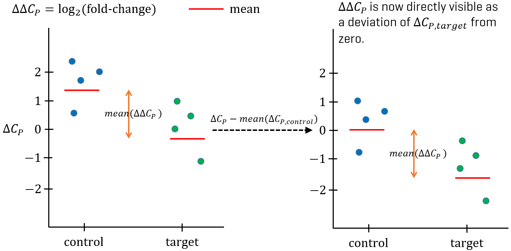

---
date: '`r glue("Document generated: {Sys.Date()}")`'
---

***

Copy, please, these files and directories to your personal directory:

```{bash, eval = FALSE}
cp -r /data/shared/AGE2020/Exercises/E03-qPCR ~/AGE2020/Exercises
```

And switch the R working directory to the current exercise: `setwd("~/AGE2020/Exercises/E03-qPCR")`

***

# Introduction

[Quantitative real-time PCR](https://en.wikipedia.org/wiki/Real-time_polymerase_chain_reaction) monitors the amplification
of a targeted DNA molecule during the PCR (i.e., in real time), not at its end, as in conventional PCR.

![In real time reverse transcription quantitave PCR (RT-qPCR), we measure the amplification of target reverse transcribed DNA molecules.
This amplification depends on initial RNA concentration and approximates the gene expression.
We select a fluorescence signal threshold $S_T$ and measure crossing points $C_P$ (also called threshold cycle $C_T$) for samples.
To correct for initial RNA concentration and quality, reference genes are used (dashed curves).
These genes are considered to be equally expressed in every condition (purple and orange curves), and so serve as the baseline.
First, we normalize each sample to reference gene by subtracting the $C_P^r$ from $C_P^t$.
We obtain the $\Delta C_t$ values which are used to calculate the <ins>relative change</ins> of gene expression
between samples, fold-change: $FC = 2^{\Delta C_P,cnt - \Delta C_P,trt}$.
We usually report $FC$ in log2 scale ($LFC = \Delta C_T,cnt - \Delta C_T,trt = log_2(FC)$).](images/qpcr_curves.png)

This will be an introductory exercise in which you will refresh your R skills
and implement (mainly visualization) functions, which you will use later on different types of data.

# Our experiment

We will work with data from pancreatic tumour experiment, where
an influence of [spirulina](https://en.wikipedia.org/wiki/Spirulina_(dietary_supplement)) algae was investigated.
In this experiment there are two sample groups:

- **control**: samples from tumour.
- **spirulina**: samples from tumour treated by extract from spirulina.

Each sample group has three biological replicates (grown on different Petri dish). In addition, each biological replicate is cultivated for 50% and 90% confluence, and for each confluence there are two technical replicates. Uhhh...


But we can expand it to:

```
- control group
  |
  |-- biological replicate #1 (Petri dish #1)
  |   |-- confluence 50
  |   |   |-- technical replicate #1 -> sample C1_C50_R1
  |   |   |-- technical replicate #2 -> sample C2_C50_R2
  |   |-- confluence 90
  |       |-- technical replicate #1 -> sample C1_C90_R1
  |       |-- technical replicate #2 -> sample C1_C90_R2
  |-- biological replicate #2 (Petri dish #2)
      |-- confluence 50
      |   |-- technical replicate #1 -> sample C2_C50_R1
      |   |-- technical replicate #2 -> sample C2_C50_R2
      |-- confluence 90
          |-- ...

- spirulina group
  |
  |-- biological replicate #1 (Petri dish #1)
  |   |-- confluence 50
  |   |   |-- technical replicate #1 -> sample S1_C50_R1
  |   |   |-- technical replicate #2 -> sample S1_C50_R2
  |   |-- confluence 90
  |       |-- technical replicate #1 -> sample S1_C90_R1
  |       |-- technical replicate #2 -> sample S1_C90_R2
  |-- biological replicate #2 (Petri dish #2)
      |-- confluence 50
      |   |-- technical replicate #1 -> sample S2_C50_R1
      |   |-- technical replicate #2 -> sample S2_C50_R2
      |-- confluence 90
          |-- ...
```

If you want, we can draw it on the board :)

Also, there are two groups of measured genes:

1. **Target genes** - interesting genes found by microarray exploratory analysis.
2. **Housekeeping genes** - used as reference genes.

# Libraries

```{r}
library(dplyr)
library(stringr)
library(tidyr)
library(glue)
library(magrittr)
```

This will be your personal library in which you implement the tasks.
Now it contains only function skeletons.
These skeletons are not obligatory, but your functions should have output
similar to what you see in this tutorial.

Note that your functions will be universal, serving not only for qPCR data.
This is mainly true for exploratory analysis functions (hiearchical clustering, PCA, etc.),
where input (expression matrix) is same also for microarrays and RNA-seq data.

```{r}
source("../age_library.R")
```

# Config

I would recommend you to always define constants at the beginning of a script. It is more transparent, and if you, for example, change some path, you haven't to
replace it in whole source code.

```{r}
CP_DATA <- "qPCR.Rds"
```

# Data preprocessing

## $C_P$ matrix

We have already preprocessed a $C_P$ matrix for you.
But if you really want to start from the floor, create the $C_P$ matrix from original files
([here](data/2015-06-08_Strnad.txt) and [here](data/2015-06-08_Strnad.xls)).

In $C_P$ matrix, columns are samples, rows are genes, and values are $C_P$ values.
This format is generally used for gene expression data and you will see it also in case of microarrays and RNA-Seq.

```{r}
cp <- readRDS(CP_DATA) %>%
  as.data.frame()
genes <- rownames(cp)
samples <- colnames(cp)

cp[1:5, 1:5]
```

CP values `>= 40` are considered out of qPCR limit:

```{r}
cp[cp > 39.9] <- NA
```

Some genes have so many NA values:

```{r}
lq_genes <- rowSums(!is.na(cp))
lq_genes
```

Let's remove them:

```{r}
lq_genes <- names(lq_genes[lq_genes <= 2])
genes <- setdiff(genes, lq_genes)
cp <- cp[genes, ]
```

Now we split genes to target and reference ones.
Latter have `H` on the end of their names:

```{r}
target_genes <- genes[str_detect(genes, ".+ H", negate = TRUE)]
ref_genes <- setdiff(genes, target_genes)

gene_groups <- if_else(str_detect(genes, " H\\d+$"), "reference", "target")
(genes_df <- data.frame(
  gene = as.character(genes),
  gene_group = factor(gene_groups, levels = c("reference", "target")),
  
  row.names = genes,
  stringsAsFactors = FALSE)
)
```

For plotting purposes, we will replace `NA`s by `40`:

```{r}
cp_plot <- replace(cp, is.na(cp), 40)
```

## Phenotypical data (sample sheet)

You usually obtain a sample sheet, but in this case we are going to parse the column names of $C_P$ matrix.

```{r}
(sample_names <- colnames(cp))

pheno_data <- data.frame(
  sample_id = sample_names,
  sample_group_code = str_match(sample_names, "^SP|K")[, 1] %>% recode_factor("K" = "c", "SP" = "sp"),
  petri_number = str_match(sample_names, "^[A-Z]{1,2}(\\d)")[, 2] %>% as.factor(),
  confluence = str_match(sample_names, "\\/(\\d{2})")[, 2] %>% as.factor(),
  replicate = str_match(sample_names, "\\((\\d)RT\\)")[, 2] %>% replace_na("1") %>% as.factor()
) %>%
  dplyr::mutate(
    sample_name_rep = glue("{sample_group_code}{petri_number}_{confluence}_r{replicate}") %>% as.character(),
    sample_name = glue("{sample_group_code}{petri_number}_{confluence}") %>% as.character(),
    sample_group = recode_factor(sample_group_code, "c" = "control", "sp" = "spirulina")
  ) %>%
  dplyr::select(sample_name_rep, sample_name, everything()) %>%
  set_rownames(.$sample_name_rep)

colnames(cp) <- rownames(pheno_data)
colnames(cp_plot) <- rownames(pheno_data)
samples <- colnames(cp)

head(pheno_data)
```

## Long data

We also create long data from `cp`, `pheno_data` and `genes_df`.

```{r}
cp_long <- as.data.frame(cp) %>%
  tibble::rownames_to_column("gene") %>%
  tidyr::pivot_longer(-gene, names_to = "sample_name_rep", values_to = "cp") %>%
  dplyr::left_join(pheno_data, by = "sample_name_rep") %>%
  dplyr::left_join(genes_df, by = "gene") %>%
  dplyr::mutate(
    cp_plot = if_else(is.na(cp), 40, cp)
  ) %>%
  dplyr::select(sample_name_rep, sample_name, gene, cp, cp_plot, gene_group, everything())

head(cp_long)
```

# Exploratory analysis on raw data

We are using exploratory analysis to have an unbiased first look at data.
It is also a crucial step to assess the biological quality control,
e.g. whether samples from different groups create separate clusters -
if not, samples might be swapped.

## Hiearchical clustering (**TASK 1**)

**TASK 1: Implement your own function which takes $C_P$ matrix and returns a dendrogram with coloring by a chosen variable.**

```{r}
color_variables <- c("sample_group", "confluence", "petri_number")

for (variable in color_variables) {
  plot_hc(
    cp_plot, color_by = pheno_data[, variable],
    method_distance = "euclidean", method_clustering = "complete",
    color_by_lab = variable
  )
}
```

## PCA (**TASK 2**)

**TASK 2: Implement a function for PCA visualization with point coloring by a chosen variable.**

- Base R:

```{r, warning = FALSE}
plot_pca(cp_plot, color_by = pheno_data$sample_group, color_by_lab = "sample_group")
```

- You can use `ggplot2`, but be prepared to use data in long format:

```{r}
plot_pca_ggplot2(cp_plot, pheno_data, color_by = "sample_group", shape_by = "confluence")$plot
```

```{r, height = 8}
plot_pca_ggplot2(cp_plot, pheno_data, color_by = "sample_group", shape_by = "confluence", label_by = "sample_name_rep")$plot
```

```{r}
plot_pca_ggplot2(cp_plot, pheno_data, color_by = "sample_group", shape_by = "petri_number")$plot
```

- You can also use `GGally::ggpairs()` to plot a grid of PCA plots (PC1 vs. PC2, PC1 vs. PC3, PC2 vs. PC3, etc):

```{r}
plot_pca_ggpairs(cp_plot, pheno_data, n_components = 5, color_by = "sample_group", shape_by = "confluence")$plot
```

## Heatmap (**TASK 3**)

**TASK 3: Implement your own function for heatmap.**

You can use a nice package [`heatmaply`](https://cran.r-project.org/web/packages/heatmaply/vignettes/heatmaply.html) which produces interactive HTML heatmaps.
Or [`pheatmap`](https://cran.r-project.org/web/packages/pheatmap/index.html) for a better alternative to `heatmap.2()`.

```{r}
plot_heatmap(as.matrix(cp_plot), color_by = pheno_data$sample_group, color_legend_lab = "Sample group", main = "Treatment (Cp values)")
plot_pheatmap(cp_plot, pheno_data, genes_df, column_color_by = color_variables, row_color_by = "gene_group", main = "qPCR")
```

```{r}
plot_heatmaply(cp_plot, pheno_data, genes_df, column_color_by = color_variables, row_color_by = "gene_group", main = "qPCR", key.title = "CP")
```

**Can you see any outlying samples (replicates)? If yes, should they be removed?**

# Normalization to reference genes

We will use housekeeping genes as reference genes.
Housekeeping genes are genes which have similar expression profile regardless the cell type or state.
That is why they can be used for sample normalization (as an internal control).

## Selecting the reference genes

### Correlation

Expression of housekeeping genes is/should be correlated.

```{r}
main_title <- "Raw data correlation"

t(cp) %>%
  as.data.frame() %>%
  GGally::ggpairs(progress = FALSE) +
  theme_bw()
```

You can also use base R:

```{r}
pairs(t(cp))
```

Let's look more closely at correlation coefficients:

```{r}
(gene_cor <- cor(t(cp), use = "pairwise.complete.obs"))
ggcorrplot::ggcorrplot(gene_cor, method = "circle") +
  ggtitle(main_title)
```

You can also use `lattice`:

```{r, eval = FALSE}
lattice::levelplot(gene_cor, main = main_title)
```

Or `heatmaply`:

```{r, eval = FALSE}
plot_heatmaply(gene_cor, feature_data = genes_df, row_color_by = "gene_group", main = main_title)
```

Housekeeping genes should cluster together.
We can try both Euclidean and [Pearson](https://en.wikipedia.org/wiki/Pearson_correlation_coefficient#Pearson's_distance)
distance (1 - correlation coefficient) for hiearchical clustering.

```{r}
plot_hc(gene_cor, color_by = gene_groups, color_by_lab = "Gene groups", method_distance = "euclidean", main = "Hierarchical clustering (Euclidean distance)")
plot_hc(gene_cor, color_by = gene_groups, color_by_lab = "Gene groups", method_distance = "pearson", main = "Hierarchical clustering (Pearson distance)")
```

PCA of correlation coefficients is also helpful:

```{r}
plot_pca_ggplot2(gene_cor, genes_df, color_by = "gene_group")$plot
plot_pca_ggpairs(gene_cor, genes_df, color_by = "gene_group")$plot
```

### geNorm M-values (**TASK 4**)

**TASK 4: Implement a function which computes the M-value.**

All reference genes are OK:

```{r}
for (g in ref_genes)
  compute_m(g, cp_plot[ref_genes, ]) %>% glue("{g}: ", .) %>% cat(sep = "\n")
```

Compare with target genes - they would not be good reference genes:

```{r}
for (g in target_genes)
  compute_m(g, cp_plot[target_genes, ]) %>% glue("{g}: ", .) %>% cat(sep = "\n")
```

## Subtracting the reference genes: $\Delta C_P$

For each sample we calculate a geometric mean of reference genes:

```{r}
norm <- apply(cp[ref_genes, ], 2, function(x) {
  log(x) %>% mean() %>% exp()
})
```

Let's look how these means behave:

```{r}
gene_cor_norm <- rbind(cp, norm = norm) %>%
  t() %>%
  cor(use = "pairwise.complete.obs")

genes_df_norm <- genes_df %>%
  dplyr::mutate(gene_group = factor(gene_group, levels = c("reference", "target", "norm"))) %>%
  rbind(norm = c("norm", "norm"))

ggcorrplot::ggcorrplot(gene_cor_norm, method = "circle") +
  ggtitle(main_title)

plot_hc(gene_cor_norm, color_by = genes_df_norm$gene_group, color_by_lab = "Gene groups", method_distance = "euclidean", main = "Hierarchical clustering (Euclidean distance)")
plot_hc(gene_cor_norm, color_by = genes_df_norm$gene_group, color_by_lab = "Gene groups", method_distance = "pearson", main = "Hierarchical clustering (Pearson distance)")

plot_pca_ggplot2(gene_cor_norm, genes_df_norm, color_by = "gene_group")$plot
plot_pca_ggpairs(gene_cor_norm, genes_df_norm, color_by = "gene_group")$plot
```

We get $\Delta C_P$ by subtracting the reference gene means:

```{r}
(ref_gene_cp_matrix <- matrix(norm, ncol = ncol(cp), nrow = nrow(cp), byrow = TRUE))
(delta_cp <- cp - ref_gene_cp_matrix)
```

Now we average technical replicates:

```{r}
samples <- unique(pheno_data$sample_name)

delta_cp_avg <- matrix(NA, nrow = nrow(delta_cp), ncol = length(samples), dimnames = list(rownames(delta_cp), samples))
delta_cp_avg[1:5, 1:5]

(tech_rep <- split(colnames(delta_cp), pheno_data$sample_name))

for (s in samples)
  delta_cp_avg[, s] <- rowMeans(delta_cp[, tech_rep[[s]], drop = FALSE], na.rm = TRUE)

# For control.
(rowMeans(delta_cp[, c("c1_50_r1", "c1_50_r2")], na.rm = TRUE) == delta_cp_avg[, "c1_50"]) %>%
  all() %>%
  stopifnot()
```

Final $\Delta C_P$:

```{r}
delta_cp_avg <- delta_cp_avg[target_genes, ]
delta_cp_avg_plot <- replace(delta_cp_avg, is.na(delta_cp_avg), ceiling(max(delta_cp_avg, na.rm = TRUE) + 1))

# Remove replicates.
pheno_data_avg <- dplyr::filter(pheno_data, replicate == 1) %>%
  dplyr::select(-sample_name_rep, -sample_id, -replicate) %>%
  dplyr::select(sample_name, everything()) %>%
  set_rownames(.$sample_name)

cp_long <- dplyr::filter(cp_long, replicate == 1) %>%
  dplyr::select(-sample_name_rep, -sample_id, -replicate) %>%
  dplyr::select(sample_name, everything())

# Add delta_cp_avg
cp_long <- as.data.frame(delta_cp_avg) %>%
  tibble::rownames_to_column("gene") %>%
  tidyr::pivot_longer(-gene, names_to = "sample_name", values_to = "delta_cp") %>%
  dplyr::right_join(cp_long, by = c("sample_name", "gene"))

# Add delta_cp_avg_plot
cp_long <- as.data.frame(delta_cp_avg_plot) %>%
  tibble::rownames_to_column("gene") %>%
  tidyr::pivot_longer(-gene, names_to = "sample_name", values_to = "delta_cp_plot") %>%
  dplyr::right_join(cp_long, by = c("sample_name", "gene"))

cp_long_target <- dplyr::filter(cp_long, gene_group == "target")
```

# Exploratory analysis on summarised and normalised data

You can check for outliers, as these could mess up a differential expression analysis.

```{r}
plot_pca_ggplot2(delta_cp_avg_plot, pheno_data_avg, color_by = "sample_group", shape_by = "confluence")$plot
plot_pca_ggpairs(delta_cp_avg_plot, pheno_data_avg, n_components = 4, color_by = "sample_group", shape_by = "confluence")$plot

for (variable in color_variables) {
  plot_hc(
    delta_cp_avg_plot,
    color_by = pheno_data_avg[, variable],
    method_distance = "euclidean",
    method_clustering = "complete",
    color_by_lab = variable
  )
}

plot_pheatmap(delta_cp_avg_plot, sample_data = pheno_data_avg, column_color_by = color_variables, main = "qPCR")
```

For plotting purposes (boxplots), we set mean $\Delta C_P$ of controls to $0$
and calculate $logFC$s ($\text{mean}(\Delta C_P,control) - \Delta C_P$).
$logFC$ is also called $\Delta \Delta C_P$.



```{r}
(control_means <- cp_long_target %>%
  dplyr::filter(sample_group == "control") %>%
  dplyr::group_by(gene) %>%
  dplyr::summarise(delta_cp_control_mean = mean(delta_cp, na.rm = TRUE)))

cp_long_target <- cp_long_target %>%
  dplyr::left_join(control_means, by = "gene") %>%
  dplyr::mutate(
    delta_cp_centered = delta_cp_control_mean - delta_cp,
    delta_cp_centered_plot = replace_na(delta_cp_centered, ceiling(max(delta_cp_centered, na.rm = TRUE) + 1))
  ) %>%
  dplyr::select(sample_name, gene, matches("_cp|cp_"), everything())

head(cp_long_target)
```

# Boxplots (**TASK 5**)

Boxplots are very informative when you want to see a difference between groups.

**TASK 5: Implement a function to produce a boxplot of $\Delta C_P$ values.**

```{r}
plot_boxplot_ggplot2(
  cp_long_target,
  x = "sample_group",
  y = "delta_cp_centered_plot",
  feature_col = "gene",
  color_by = "sample_group",
  main = "qPCR"
)
```

```{r}
for (g in target_genes) {
  p1 <- plot_boxplot_ggplot2(
    cp_long_target,
    x = "sample_group",
    y = "delta_cp_centered_plot",
    feature_col = "gene",
    feature = g,
    main = "qPCR",
    color_by = "sample_group"
  )
  
  p2 <- plot_boxplot_ggplot2(
    cp_long_target,
    x = "sample_group",
    y = "delta_cp_centered_plot",
    feature_col = "gene",
    feature = g,
    main = "qPCR",
    color_by = "sample_group",
    facet_by = "confluence"
  )
  
  p1_p2 <- cowplot::plot_grid(p1, p2, ncol = 2)
  
  print(p1_p2)
}
```

# t-test (**TASK 6**)

t-test is testing whether two means coming from data having Student's distribution significantly differ.

**TASK 6: Implement a function which do the t-test of gene from two groups.**

```{r}
for (g in target_genes) {
  test_results <- test_gene(
    gene = g,
    gene_data = cp_long_target,
    gene_col = "gene",
    value_col = "delta_cp_centered",
    group_col = "sample_group",
    test = t.test,
    verbose = TRUE
  )
  cat("\n")
}
```

Or you can return a table for all genes:

```{r}
(test_table <- test_gene_table(
  gene_data = cp_long_target,
  gene_col = "gene",
  value_col = "delta_cp_centered",
  group_col = "sample_group"
))
```

# Cleanup

```{r, warning = TRUE, message = TRUE}
save.image("qPCR.RData")

warnings()
traceback()
sessionInfo()
```

# HTML rendering

This chunk is not evaluated (`eval = FALSE`). Otherwise you will probably end up in recursive hell :)

```{r, eval = FALSE, message = FALSE, warning = FALSE}
library(rmarkdown)
library(knitr)
library(glue)

# You can set global chunk options. Options set in individual chunks will override this.
opts_chunk$set(warning = FALSE, message = FALSE)
render("qPCR.Rmd", output_file = "qPCR.html")
```
