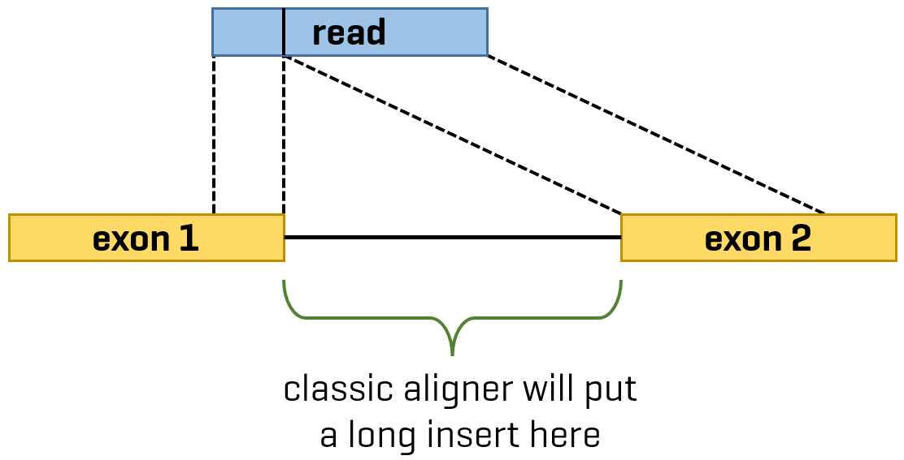

---
date: '`r glue("Document generated: {Sys.Date()}")`'
---

```{r, eval = TRUE, include = FALSE, echo = FALSE}
if (!require(emo))
  devtools::install_github("hadley/emo")
```

```{r, eval = TRUE, echo = FALSE}
HIGHLIGHT_TYPE <- "highlightjs"
```

```{r, eval = TRUE, child = "../../tooltip_child.Rmd"}
```

```{js, echo = FALSE, eval = TRUE}
$(document).ready(function () {
  var regex = new RegExp("^NOTE:\\s");
  var p_note = $("p").filter(function () {
      return regex.test($(this).text()); 
  });
  
  p_note.addClass("bg-success");
});
```

***

Copy, please, these files and directories to your personal directory:

```{bash, eval = FALSE}
cp -r /data/shared/AGE2020/Exercises/E07-RNA_seq/02_quantification ~/AGE2020/Exercises/E07-RNA_seq
cp -r /data/shared/AGE2020/Exercises/E07-RNA_seq/_bin ~/AGE2020/Exercises/E07-RNA_seq
cp -r /data/shared/AGE2020/Exercises/E07-RNA_seq/_data/{sample_sheet_airway.csv,genome,rna_sequences,transcriptome} ~/AGE2020/Exercises/E07-RNA_seq/_data
```

And switch the R working directory to the current exercise: `setwd("~/AGE2020/Exercises/E07-RNA_seq/02_quantification")`

We will be mostly working in shell, so also make sure your current working directory in terminal is `~/AGE2020/Exercises/E07-RNA_seq/02_quantification`.
Some command will take time to finish, so I recommend you to work in `tmux` session, as you will be anytime able to exit your SSH connection
and later to come back to your work.

You have also copied directory (`_bin`) with some tools.
To make them available in shell, you need to add this directory to `$PATH` and make these files executable:

```{bash}
export PATH=~/AGE2020/Exercises/E07-RNA_seq/_bin:$PATH
chmod +x ~/AGE2020/Exercises/E07-RNA_seq/_bin/*
```

We also need to install additional software.
We will use `conda` and install them to a virtual environment simply called `tools`:

```{bash}
conda create -n tools
conda deactivate
conda activate tools
conda install -c bioconda preseq subread salmon rseqc

## This should be also OK, but we have used rseqc package in bioconda channel.
# conda install python
# pip install cython rseqc
```

Also one R package is missing, let's install it:

```{r}
BiocManager::install("Rsubread")
```

NOTE: To easily distinguish between R and bash code chunks, you can hover over a chunk and code type will appear on the left side.

***

# Introduction

In this tutorial we will show how to:

- Filter out tRNA and rRNA reads using `SortMeRNA` tool.
- Quantify gene expression to obtain a count matrix, including quality control of this process.
- Import the resulting count matrix to R.

Generally, there are two ways how to do quantification (see the figure below):

- **Aligner pipeline**: Align reads to reference genome to obtain BAM file and count reads overlapping a feature (e.g. exon)
  - We will use [GSNAP](http://research-pub.gene.com/gmap/) for alignment and `featureCounts` tool from
    [subread](http://subread.sourceforge.net/) package for counting.
    We will use two versions of `featureCounts`: command-line and from within R through
    [Rsubread](http://bioconductor.org/packages/release/bioc/html/Rsubread.html) package.
- **Pseudoaligner pipeline**: Map reads to reference transcriptome (pseudoalignment) and directly obtain a transcript-level count matrix (transcript abundance).
  - We will use [Salmon](https://combine-lab.github.io/salmon/) for this and later import the count matrix to R.


We will continue with trimmed data from the previous exercise.

***

# Config

Here we will set paths to files and directories.
This is copypasted from the previous exercise.

```{bash}
# This is a root directory for data.
BASE_DATA_DIR="../_data"
mkdir $BASE_DATA_DIR

# Here you will find experiment data.
EXPERIMENT_DATA_DIR="$BASE_DATA_DIR/experiment"
mkdir $EXPERIMENT_DATA_DIR

# Directory to store trimmed data.
TRIMMED_DATA_DIR="$BASE_DATA_DIR/experiment_trimmed"
mkdir $TRIMMED_DATA_DIR

# Directory for MultiQC output. Will be created automatically by MultiQC.
MULTIQC_DIR="multiqc"

# Directory for temporary files.
TMP_DIR="$BASE_DATA_DIR/tmp"
mkdir $TMP_DIR

SAMPLE_NAMES=("SRR1039508" "SRR1039509" "SRR1039512" "SRR1039513")
```

But here are new variables with paths to reference files and directories for `SortMeRNA`.

```{bash}
N_THREADS=2

### Reference genome and its annotation files.
# Reference sequence of human chromosome 20 in gzipped FASTA format.
HG37_GENOME="../_data/genome/Homo_sapiens.GRCh37.75.dna.chromosome.20.fa.gz"
# Annotation for human reference genome in gzipped GTF format.
HG37_ANN_GZ="../_data/genome/Homo_sapiens.GRCh37.75.gtf.gz"
HG37_ANN="../_data/genome/Homo_sapiens.GRCh37.75.gtf"
# Human reference transcriptome.
HG37_TRANS="../_data/transcriptome/Homo_sapiens.GRCh37.75.cdna.all.fa.gz"

### SortMeRNA
# Reference sequences of human rRNA and tRNA.
SORTMERNA_REFERENCE_DIR="../_data/rna_sequences"
HUMAN_RRNA_FASTA="human_rRNA.fa"
HUMAN_TRNA_FASTA="human_tRNA.fa"

# Directory for SortMeRNA index of our reference sequences.
SORTMERNA_INDEX_DIR="sortmerna_index"
mkdir $SORTMERNA_INDEX_DIR

# Filtered reads = without rRNA and tRNA.
SORTMERNA_FILTERED_OUT_DIR="sortmerna_filtered"
mkdir $SORTMERNA_FILTERED_OUT_DIR

# Directory for logs from SortMeRNA which we later parse with MultiQC.
SORTMERNA_LOG_DIR="sortmerna_log"
mkdir $SORTMERNA_LOG_DIR

# Directory for temporary files which will be later removed.
SORTMERNA_TMP_DIR="sortmerna_tmp"
mkdir $SORTMERNA_TMP_DIR

# Directory to store trimmed and rRNA/tRNA filtered data.
TRIMMED_FILTERED_DATA_DIR="$BASE_DATA_DIR/experiment_trimmed_filtered"
mkdir $TRIMMED_FILTERED_DATA_DIR

### Paths for GSNAP
# Directory to store index of reference genome.
GSNAP_INDEX_DIR="$BASE_DATA_DIR/gsnap_index_hg37_chr20"

# Directory to store alignments.
GSNAP_OUT_DIR="gsnap_out"
mkdir $GSNAP_OUT_DIR

### RSeQC
HG37_ANN_BED="../_data/genome/hg19_ensembl_gene.bed"
HG37_ANN_BED_FIX="../_data/genome/hg19_ensembl_gene_fix.bed"

RSEQC_OUT_DIR="rseqc_out"
mkdir $RSEQC_OUT_DIR

### preseq
PRESEQ_OUT_DIR="preseq_out"
mkdir $PRESEQ_OUT_DIR

### featureCounts
# Directory to store biotype counts.
FC_OUT="featurecounts_biotypes_out"
mkdir $FC_OUT

### Salmon
SALMON_INDEX_DIR="$BASE_DATA_DIR/salmon_index_hg37_chr20"
SALMON_OUT_DIR="salmon_out"
```

We will use human reference genome (chromosome 20) and transcriptome, which are both in older version 37.75,
the same as in [F1000 tutorial](https://f1000research.com/articles/4-1070/v2) of which this exercise is largely based on.

We have already downloaded all the files for you, but it is good to know where to get such files.
The main source is [ENSEMBL FTP](ftp://ftp.ensembl.org/pub/) (although other reference sources exist).
For each release (such as 75 in our case) there is a following directory structure:
`<file type>/<organism>/<files>`.
For example:

- Human genome and transcriptome references in FASTA format are located in
  `release-75/fasta/homo_sapiens/dna` and `release-75/fasta/homo_sapiens/cdna` directory, respectively.
- Human genome annotation is located in `release-75/gtf/homo_sapiens`.

In each of these directories there is also a `README` file describing a content of files in that directory
([example](ftp://ftp.ensembl.org/pub/release-75/fasta/homo_sapiens/dna/README) for human reference genome files).

If you are working on a remote server, `wget` tool provides the easiest way to download the files.
The basic command is:

```{bash}
wget -O output_file url
```

For example:

```{bash}
wget -O my_transcriptomes/human_transcriptome.fa.gz ftp://ftp.ensembl.org/pub/release-75/fasta/homo_sapiens/cdna/Homo_sapiens.GRCh37.75.cdna.all.fa.gz
```

You can omit the `-O` parameter and `wget` will download the file to the current directory and with the original filename.

***

# Filtering out rRNA and tRNA - `SortMeRNA`

Our library could be contaminated by ribosomal and transfer RNA.
Although this contamination won't affect a subsequent differential expression analysis,
it can significantly slow-down an alignment, because those RNAs contain long repeating sequences.

[`SortMeRNA`](https://bioinfo.lifl.fr/RNA/sortmerna/) is a tool for filtering, mapping and OTU-picking NGS reads
in metatranscriptomic and metagenomic data.
`SortMeRNA` takes as input a file with reads (FASTA or FASTQ format) and one or multiple rRNA/tRNA database file(s) (FASTA),
and sorts apart rRNA/tRNA and rejected reads into two files specified by the user.
Although its primary purpose is filtering metagenomic data, it can be easily used for classic RNA-seq data.
At the end we will use `MultiQC` to report `SortMeRNA` log - a percentage of rRNA/tRNA in our samples.

The simplified `SortMeRNA` pipeline is depicted here:


```{bash}
# First we copy FASTA files with reference sequences to directory for SortMeRNA index.
cp $SORTMERNA_REFERENCE_DIR/$HUMAN_RRNA_FASTA $SORTMERNA_REFERENCE_DIR/$HUMAN_TRNA_FASTA $SORTMERNA_INDEX_DIR

# Create FASTA index.
samtools faidx $SORTMERNA_INDEX_DIR/$HUMAN_RRNA_FASTA
samtools faidx $SORTMERNA_INDEX_DIR/$HUMAN_TRNA_FASTA

# Create SortMeRNA index.
cd $SORTMERNA_INDEX_DIR
indexdb_rna --ref $HUMAN_RRNA_FASTA,$HUMAN_RRNA_FASTA.fai:$HUMAN_TRNA_FASTA,$HUMAN_TRNA_FASTA.fai
cd -

for sample in ${SAMPLE_NAMES[@]}; do
  # SortMeRNA cannot work directly with paired-end data.
  # Its input is a single FASTQ file. However, authors provide two scripts to merge and unmerge paired-end data.
  merge-paired-reads.sh \
    $TRIMMED_DATA_DIR/${sample}*_1P.fastq \
    $TRIMMED_DATA_DIR/${sample}*_2P.fastq \
    $SORTMERNA_TMP_DIR/${sample}.fastq
  
  sortmerna \
    --reads $SORTMERNA_TMP_DIR/${sample}.fastq \
    --ref $SORTMERNA_INDEX_DIR/$HUMAN_RRNA_FASTA,$SORTMERNA_INDEX_DIR/$HUMAN_RRNA_FASTA.fai:$SORTMERNA_INDEX_DIR/$HUMAN_TRNA_FASTA,$SORTMERNA_INDEX_DIR/$HUMAN_TRNA_FASTA.fai \
    --aligned $SORTMERNA_TMP_DIR/${sample}_rRNA_tRNA \
    --other $SORTMERNA_TMP_DIR/${sample}_filtered \
    --paired_in \
    --fastx \
    -a $N_THREADS \
    --log \
    -v
  
  unmerge-paired-reads.sh \
    $SORTMERNA_TMP_DIR/${sample}_filtered.fastq \
    $TRIMMED_FILTERED_DATA_DIR/${sample}_trimmomatic_filtered_1.fastq \
    $TRIMMED_FILTERED_DATA_DIR/${sample}_trimmomatic_filtered_2.fastq
  
  mv $SORTMERNA_TMP_DIR/${sample}*.log $SORTMERNA_LOG_DIR
done

rm -r $SORTMERNA_TMP_DIR/*
```

<p>
  <button class="btn btn-primary btn-sm" type="button" data-toggle="collapse" data-target="#div_info_sortmerna" aria-expanded="false" aria-controls="collapseExample">
    Show parameters info
  </button>
</p>

<div class="collapse div-collapse-info" id="div_info_sortmerna">

- `samtools faidx $SORTMERNA_INDEX_DIR/$HUMAN_RRNA_FASTA`{.bash}
  - Create an index (`.fai` extension) for FASTA file.
- `indexdb_rna --ref $HUMAN_RRNA_FASTA,$HUMAN_RRNA_FASTA.fai:$HUMAN_TRNA_FASTA,$HUMAN_TRNA_FASTA.fai`{.bash}
  - Create an index for SortMeRNA. `--ref` format is `ref1.fasta,ref1.fasta.fai:ref2.fasta,ref2.fasta.fai`.
- `merge-paired-reads.sh forward-reads.fastq reverse-reads.fastq merged-reads.fastq`{.bash}
  - Merge paired-end reads. That is, put paired reads side by side into one FASTQ file.
- `unmerge-paired-reads.sh merged-reads.fastq forward-reads.fastq reverse-reads.fastq`{.bash}
  - Unmerge paired-end reads. That is, split paired reads to two FASTQ files.

***

`sortmerna`:

- `--reads $TMP_DIR/${sample}_merged.fastq`{.bash}
  - Input FASTQ file. Paired-end reads must be merge before with `merge-paired-reads.sh` script.
- `--ref`{.bash}
  - Reference FASTA. Same parameter format as in `indexdb_rna`.
- `--aligned $TMP_DIR/${sample}_rRNA`{.bash}
  - Put aligned reads to this file. `.fastq` extension is added automatically.
- `--other $TMP_DIR/${sample}_filtered`{.bash}
  - Put non-aligned reads to this file - these are reads we are interested in. `.fastq` extension is added automatically.
- `--paired_in`{.bash}
  - SortMeRNA assigns each read individually.
    In case one read from the pair aligns to reference, whole pair will be put to FASTQ with aligned reads.
    Another option is `--paired_out`, which do the opposite.
    So these parameters ensure that read pairs won't be split to aligned and other FASTQ files.
- `--fastx`{.bash}
  - Output is FASTQ file.
- `-a $N_THREADS`{.bash}
  - Use this number of threads.
- `-log`{.bash}
  - Create a log file. It will be named `--reads <file>.log`.
- `-v`{.bash}
  - Be verbose.

</div>

***

# Alignment to genome

At this moment, we have our reads ready for the alignment.
We will align reads to reference genome chromosome 20 (-> BAM file) and then count reads
overlapping exons/genes to obtain a gene-level count matrix (-> tab-separated file).

## Aligner - `GSNAP`

Our aligner will be [`GSNAP`](http://research-pub.gene.com/gmap/).
To effectively align reads, `GSNAP` needs to make an index of genome. Let's create it:

```{bash}
gmap_build \
  --dir=$GSNAP_INDEX_DIR \
  --db=$(basename $GSNAP_INDEX_DIR) \
  --gunzip \
  --sort="chrom" \
  --circular="MT" \
  $HG37_GENOME
```

<p>
  <button class="btn btn-primary btn-sm" type="button" data-toggle="collapse" data-target="#div_info_gsnap_index" aria-expanded="false" aria-controls="collapseExample">
    Show parameters info
  </button>
</p>

<div class="collapse div-collapse-info" id="div_info_gsnap_index">

- `--dir=$GSNAP_INDEX_DIR`{.bash}
  - Save index into this directory.
- `--db=$(basename $GSNAP_INDEX_DIR)`{.bash}
  - Name of index (subdirectory in `--dir` will be created).
    `basename` will output the part behind the last `/` in `$GSNAP_INDEX_DIR`.
- `--gunzip`{.bash}
  - Input files are compressed with gzip.
- `--sort="chrom"`{.bash}
  - Sort index by chromosomes.
- `--circular="MT"`{.bash}
  - Which chromosomes are circular.
- `$HG37_GENOME`{.bash}
  - Path to genome FASTA file.

</div>

***

Now we create information about splice sites. That's because we are mapping reads coming from mRNA to genome which includes introns.
So without the splicing information, "classic aligner" will put a long insert to alignment of reads which span introns.
With splicing information, "splice-aware aligner" (such as `GSNAP`) knows the location of exons,
so reads can be aligned to two exons without a long insert inside an intron.



`GSNAP` has a tool for making such a file with splice sites information.
But first we decompress the genome annotation GTF file.

```{bash}
zcat $HG37_ANN_GZ > $HG37_ANN
cat $HG37_ANN | gtf_splicesites | iit_store -o $GSNAP_INDEX_DIR/splice_sites
```

<p>
  <button class="btn btn-primary btn-sm" type="button" data-toggle="collapse" data-target="#div_info_gsnap_splicesites" aria-expanded="false" aria-controls="collapseExample">
    Show parameters info
  </button>
</p>

<div class="collapse div-collapse-info" id="div_info_gsnap_splicesites">

- `gtf_splicesites`{.bash}
  - Extract splice sites (exons) and send it to stdout in GTF format.
- `iit_store -o $GSNAP_INDEX_DIR/splice_sites`{.bash}
  - Compress GTF and save it to the file `$GSNAP_INDEX_DIR/splice_sites`.

</div>

***

All the files required for alignment are ready, so we can start it.
Later we will use `MultiQC` to report log files from `GSNAP`.
We loop through the FASTQ files and for each we perform the alignment and subsequent processing with `samtools` -
converting to BAM format (compressed SAM), sorting alignment by position and creating BAM index.

```{bash}
for sample in ${SAMPLE_NAMES[@]}; do
  out_file_path=$GSNAP_OUT_DIR/$sample

  gsnap \
  --nthreads=$N_THREADS \
  --dir=$GSNAP_INDEX_DIR \
  --db=$(basename $GSNAP_INDEX_DIR) \
  --use-splicing=$GSNAP_INDEX_DIR/splice_sites \
  --gunzip \
  --format="sam" \
  --output-file=$out_file_path.sam \
  ${TRIMMED_FILTERED_DATA_DIR}/${sample}*_1.fastq \
  ${TRIMMED_FILTERED_DATA_DIR}/${sample}*_2.fastq
  
  samtools view -Sb -@$N_THREADS $out_file_path.sam |
    samtools sort -@$N_THREADS -o $GSNAP_OUT_DIR/$sample.bam -
  samtools index $GSNAP_OUT_DIR/$sample.bam
done
```

<p>
  <button class="btn btn-primary btn-sm" type="button" data-toggle="collapse" data-target="#div_info_gsnap_alignment" aria-expanded="false" aria-controls="collapseExample">
    Show parameters info
  </button>
</p>

<div class="collapse div-collapse-info" id="div_info_gsnap_alignment">

- `--nthreads=$N_THREADS`{.bash}
  - Use this number of threads.
- `--dir=$GSNAP_INDEX_DIR`{.bash}
  - Index directory.
- `--db=$(basename $GSNAP_INDEX_DIR)`{.bash}
  - Name of genome index.
- `--use-splicing=$GSNAP_INDEX_DIR/splice_sites`{.bash}
  - Path to file with splicing information.
- `--gunzip`{.bash}
  - Input files are compressed with gzip.
- `--format="sam"`{.bash}
  - Output in SAM format.
- `--output-file=$GSNAP_OUT_DIR/$sample.sam`{.bash}
  - Path to output file.
- `${TRIMMED_FILTERED_DATA_DIR}/${sample}*_1.fastq`{.bash}
  - Forward reads of a sample.
- `${TRIMMED_FILTERED_DATA_DIR}/${sample}*_2.fastq`{.bash}
  - Reverse reads of a sample.

***

- `samtools view -Sb -@$N_THREADS $out_file_path.sam |`{.bash}
  - Convert to BAM format using this number of threads (`-@$N_THREADS`) and pipe the output (stdout).
- `samtools sort -@$N_THREADS -o $GSNAP_OUT_DIR/$sample.bam -`{.bash}
  - Read input (stdin), sort it by position and save it to `$GSNAP_OUT_DIR/$sample.bam`.
    `samtools` are designed to read stdin when `-` is supplied as the input file.
- `samtools index $GSNAP_OUT_DIR/$sample.bam`{.bash}
  - Create index of a BAM file.

</div>

***

## Quality control of the alignment

### `RSeQC`

Taken from the [RSeQC](http://rseqc.sourceforge.net) homepage:

> RSeQC package provides a number of useful modules that can comprehensively evaluate high throughput
sequence data especially RNA-seq data. Some basic modules quickly inspect sequence quality,
nucleotide composition bias, PCR bias and GC bias, while RNA-seq specific modules evaluate sequencing saturation,
mapped reads distribution, coverage uniformity, strand specificity, transcript level RNA integrity etc.

`RSeQC` is composed of several command-line tools. Probably the most useful ones are [supported by `MultiQC`](https://multiqc.info/docs/#rseqc).
We run few of them them and then create a summarized `MultiQC` report.
For some of its tools, `RSeQC` needs an annotation in BED format, which is different from GTF.
Fortunately, authors also [provide](https://sourceforge.net/projects/rseqc/files/BED/Human_Homo_sapiens/hg19_Ensembl_gene.bed.gz/download) these annotations
and we will use the annotation of [ENSEMBL GRCh37/hg19](https://sourceforge.net/projects/rseqc/files/BED/Human_Homo_sapiens/hg19_Ensembl_gene.bed.gz/download)
genome to which we aligned our reads (you should always use annotation of the same version of genome).
You can make your own annotation [here](https://genome.ucsc.edu/cgi-bin/hgTables?command=start).

But there is one problem: in our reference genome, chromosomes are named just with their numbers (e.g. `1`, `2`).
In the annotation BED file, chromosome names contain `chr` prefix (e.g. `chr1`, `chr2`).
So we need to change the BED file a little bit: remove all `chr` prefixes.
We can do it easily with `awk`:

```{bash}
awk '{ gsub("^chr", "", $1); print $0 }' $HG37_ANN_BED > $HG37_ANN_BED_FIX
```

<p>
  <button class="btn btn-primary btn-sm" type="button" data-toggle="collapse" data-target="#div_info_bed_awk" aria-expanded="false" aria-controls="collapseExample">
    Show `awk` explanation
  </button>
</p>

<div class="collapse div-collapse-info" id="div_info_bed_awk">

- `gsub("^chr", "", $1)`{.bash}
  - In the first column, remove the leading `chr` string.
- `print $0`
  - Print all columns.

</div>

Now we can run some `RSeQC` tools on each of our samples:

```{bash}
for sample in ${SAMPLE_NAMES[@]}; do
  echo "Processing sample $sample ..."

  in_file_path=$GSNAP_OUT_DIR/$sample.bam

  bam_stat.py -i $in_file_path > $RSEQC_OUT_DIR/$sample.bam_stat.txt
  read_distribution.py -i $in_file_path -r $HG37_ANN_BED_FIX > $RSEQC_OUT_DIR/$sample.read_distribution.txt
  infer_experiment.py -i $in_file_path -r $HG37_ANN_BED_FIX > $RSEQC_OUT_DIR/$sample.infer_experiment.txt
  inner_distance.py -i $in_file_path -r $HG37_ANN_BED_FIX -o $RSEQC_OUT_DIR/$sample.rseqc
done
```

<p>
  <button class="btn btn-primary btn-sm" type="button" data-toggle="collapse" data-target="#div_info_rseqc" aria-expanded="false" aria-controls="collapseExample">
    Show RSeQC tools info
  </button>
</p>

<div class="collapse div-collapse-info" id="div_info_rseqc">

- [`bam_stat.py`](http://rseqc.sourceforge.net/#bam-stat-py)
  - Summarizing mapping statistics of a BAM or SAM file.
- [`read_distribution.py`](http://rseqc.sourceforge.net/#read-distribution-py)
  - Provided a BAM/SAM file and reference gene model, this module will calculate how mapped reads were distributed
    over genome feature (like CDS exon, 5'UTR exon, 3' UTR exon, Intron, Intergenic regions).
- [`infer_experiment.py`](http://rseqc.sourceforge.net/#infer-experiment-py)
  - This program is used to "guess" how RNA-seq sequencing were configured, particulary how reads were stranded for
    strand-specific RNA-seq data, through comparing the "strandness of reads" with the "strandness of transcripts".
- [`inner_distance.py`](http://rseqc.sourceforge.net/#inner-distance-py)
  - This module is used to calculate the inner distance (or insert size) between two paired RNA reads.
    The distance is the mRNA length between two paired reads.

</div>

### `preseq` - checking library complexity

From the [`preseq`](http://smithlabresearch.org/software/preseq/) homepage:

> The `preseq` package is aimed at predicting and estimating the complexity of a genomic sequencing library,
equivalent to predicting and estimating the number of redundant reads from a given sequencing depth and
how many will be expected from additional sequencing using an initial sequencing experiment.
The estimates can then be used to examine the utility of further sequencing, optimize the sequencing depth,
or to screen multiple libraries to avoid low complexity samples.

Good reading regarding `preseq` is this blog post called
["How deep should we sequence?"](https://davetang.org/muse/2013/07/10/how-deep-should-we-sequence/).

We will use `lc_extrap` function, which computes the expected future yield of distinct reads and bounds on the number of
total distinct reads in the library and the associated confidence intervals.
Later we will report the output with `MultiQC`.

So let's run `preseq` on each of our samples:

```{bash}
for sample in ${SAMPLE_NAMES[@]}; do
  echo "Processing sample $sample ..."

  in_file_path=$GSNAP_OUT_DIR/$sample.bam
  
  preseq lc_extrap -B $in_file_path -o $PRESEQ_OUT_DIR/$sample.ccurve.txt
done
```

***

## `featureCounts` - quantification

Now comes the quantification itself.
The tool [`featureCounts`](http://bioinf.wehi.edu.au/featureCounts/) from the suite [`subread`](http://subread.sourceforge.net/)
is a popular quantification software.

`featureCounts` takes as input SAM/BAM files and an annotation file including chromosomal coordinates of features.
It outputs numbers of reads assigned to features (or meta-features).
It also outputs stat info for the overall summrization results, including number of successfully
assigned reads and number of reads that failed to be assigned due to various reasons.

Each entry in the provided annotation file is taken as a **feature** (e.g. an exon).
A **meta-feature** is the aggregation of a set of features (e.g. a gene).
The `featureCounts` program uses the gene_id attribute available in the GTF format annotation
(or the GeneID column in the SAF format annotation) to group features into meta-features,
i.e. features belonging to the same meta-feature have the same gene identifier.

A read is said to overlap a feature if at least one read base is found to overlap the feature.
For paired-end data, a fragment (or template) is said to overlap a feature if any of the
two reads from that fragment is found to overlap the feature.

By default, `featureCounts` does not count reads overlapping with more than one feature
(or more than one meta-feature when summarizing at meta-feature level).
Users can use the -O option to instruct `featureCounts` to count such reads
(they will be assigned to all their overlapping features or meta-features).

Note that, when counting at the meta-feature level, reads that overlap multiple features of
the same meta-feature are always counted exactly once for that meta-feature, provided there is no
overlap with any other meta-feature. For example, an exon-spanning read will be counted only once
for the corresponding gene even if it overlaps with more than one exon.

`featureCounts` can count reads at either feature level or at meta-feature level.
When summarizing reads at meta-feature level, read counts obtained for features included in the
same meta-feature will be added up to yield the read count for the corresponding meta-feature.

First of all, we will use the command-line version of `featureCounts` to get a number
of biotypes (`gene_biotype` in GTF annotation), such as protein coding, rRNA, miRNA, etc.

Let's examine in our GTF annotation what is actually `featureCounts` using as features and meta-features:

```{bash}
cat $HG37_ANN | head | cut -f 3,9
```

You should see this:

```
#!genome-build GRCh37.p13
#!genome-version GRCh37
#!genome-date 2009-02
#!genome-build-accession NCBI:GCA_000001405.14
#!genebuild-last-updated 2013-09
gene    gene_id "ENSG00000223972"; gene_name "DDX11L1"; gene_source "ensembl_havana"; gene_biotype "pseudogene";
transcript      gene_id "ENSG00000223972"; transcript_id "ENST00000456328"; gene_name "DDX11L1"; gene_source "ensembl_havana"; gene_biotype "pseudogene"; transcript_name "DDX11L1-002"; transcript_source "havana";
exon    gene_id "ENSG00000223972"; transcript_id "ENST00000456328"; exon_number "1"; gene_name "DDX11L1"; gene_source "ensembl_havana"; gene_biotype "pseudogene"; transcript_name "DDX11L1-002"; transcript_source "havana"; exon_id "ENSE00002234944";
exon    gene_id "ENSG00000223972"; transcript_id "ENST00000456328"; exon_number "2"; gene_name "DDX11L1"; gene_source "ensembl_havana"; gene_biotype "pseudogene"; transcript_name "DDX11L1-002"; transcript_source "havana"; exon_id "ENSE00003582793";
exon    gene_id "ENSG00000223972"; transcript_id "ENST00000456328"; exon_number "3"; gene_name "DDX11L1"; gene_source "ensembl_havana"; gene_biotype "pseudogene"; transcript_name "DDX11L1-002"; transcript_source "havana"; exon_id "ENSE00002312635";
```

In the third field in GTF there are features and we will use exons for counting.
In the nineth field there are possible meta-features used for grouping the counts.
To count biotypes we will use the meta-feature `gene_biotype`.

```{bash}
featureCounts -a $HG37_ANN -t exon -g gene_biotype -o $FC_OUT/biotype_counts.tsv -p -C -T $N_THREADS $GSNAP_OUT_DIR/*.bam
```

<p>
  <button class="btn btn-primary btn-sm" type="button" data-toggle="collapse" data-target="#div_info_featurecounts" aria-expanded="false" aria-controls="collapseExample">
    Show `featureCounts` parameters info
  </button>
</p>

<div class="collapse div-collapse-info" id="div_info_featurecounts">

- `-a $HG37_ANN`{.bash}
  - Annotation file in GTF format.
- `-t exon`{.bash}
  - Feature to count reads is `exon`.
- `-g gene_biotype`{.bash}
  - Meta-feature to group counts is `gene_biotype`.
- `-o $FC_OUT/biotype_counts.tsv`{.bash}
  - Output counts to this file.
- `-p`{.bash}
  - Input files contain paired-end reads.
- `-C`{.bash}
  - Do not count read pairs that have their two ends mapping to
    different chromosomes or mapping to same chromosome but on different strands.
    These reads are called chimeric.
- `-T $N_THREADS`{.bash}
  - Use this number of threads.
- `$GSNAP_OUT_DIR/*.bam`{.bash}
  - Input files.

</div>

Let's look at the number of distinct biotypes:

```{bash}
cut -f1,7,8,9,10 $FC_OUT/biotype_counts.tsv
```

```
# Program:featureCounts v2.0.0; Command:"featureCounts" "-a" "../_data/genome/Homo_sapiens.GRCh37.75.gtf" "-t" "exon" "-g" "gene_biotype" "-o" "featurecounts_biotypes_out/biotype_counts.tsv" "-p" "-T" "2" "gsnap_out/SRR1039508.bam" "gsnap_out/SRR1039509.bam" "gsnap_out/SRR1039512.bam" "gsnap_out/SRR1039513.bam"
Geneid  gsnap_out/SRR1039508.bam  gsnap_out/SRR1039509.bam      gsnap_out/SRR1039512.bam        gsnap_out/SRR1039513.bam
pseudogene      52727   48773   45473   38428
lincRNA 6022    5851    6013    5665
protein_coding  102773  99806   99467   95016
antisense       4195    4169    3724    3633
processed_transcript    772     754     802     702
snRNA   102     88      117     96
sense_intronic  100     102     105     109
miRNA   135     155     126     161
misc_RNA        295     292     198     269
snoRNA  78      95      70      87
rRNA    22      25      20      24
3prime_overlapping_ncrna        0 0     0       0
polymorphic_pseudogene  0       0 0     0
sense_overlapping       24      27      21      30
IG_V_gene       0       0       0 0
IG_C_gene       0       0       0 0
IG_J_gene       0       0       0 0
IG_V_pseudogene 0       0       0 0
TR_C_gene       0       0       0 0
TR_J_gene       0       0       0 0
TR_V_gene       0       0       0 0
TR_V_pseudogene 0       0       0 0
IG_C_pseudogene 0       0       0 0
TR_D_gene       0       0       0 0
TR_J_pseudogene 0       0       0 0
IG_J_pseudogene 0       0       0 0
IG_D_gene       0       0       0 0
processed_pseudogene    0       0 0     0
Mt_tRNA 0       0       0       0
Mt_rRNA 0       0       0       0
```

***

Now let's move into R and do the gene-level quantification using the `featureCounts()`
function from [`Rsubread`](https://bioconductor.org/packages/release/bioc/html/Rsubread.html) package.
We will use the meta-feature `gene_id`.

**Don't forget to set your R working directory to `/data/persistent/jirinovo/AGE2020/Exercises/E07-RNA_seq/02_quantification` with the `setwd()` function.**

```{r, eval = TRUE}
library(Rsubread)
library(glue)

# pattern = ".bam$" will match all files ending with ".bam", so it won't include ".bam.bai" files.
bam_files <- list.files("gsnap_out", pattern = ".bam$", full.names = TRUE)
annot_file <- "../_data/genome/Homo_sapiens.GRCh37.75.gtf"

res <- featureCounts(
  files = bam_files,
  annot.ext = annot_file,
  isGTFAnnotationFile = TRUE,
  GTF.featureType = "exon",
  useMetaFeatures = TRUE,
  GTF.attrType = "gene_id",
  isPairedEnd = TRUE,
  # We want to discard reads mapping to multiple locations (i.e. reads having multiple alignments in BAM file).
  countMultiMappingReads = FALSE,
  # We want to discard reads which have multiple features or meta-features assigned.
  allowMultiOverlap = FALSE,
  # We want to discard fragments which has its two reads mapped to different chromosomes.
  countChimericFragments = FALSE,
  nthreads = 2
)
```

`res` is a `list` object with several values:

```{r, eval = TRUE}
names(res)
```

- `counts`: the count matrix, in which rows are genes and columns are samples.

```{r, eval = TRUE}
res$counts[1:5, ]
```

- `stat`: counting summary.

```{r, eval = TRUE}
res$stat
```

We can calculate the percentage of assigned and unassigned reads for each sample:

```{r, eval = TRUE}
rownames(res$stat) <- res$stat$Status
res$stat$Status <- NULL

assigned_percent <- apply(res$stat, MARGIN = 2, FUN = function(x) {
  round((x["Assigned"] / sum(x)) * 100, 2)
})

unassigned_percent <- 100 - assigned_percent

glue("Assigned reads of {names(assigned_percent)}: {assigned_percent}%")
glue("Unassigned reads of {names(unassigned_percent)}: {unassigned_percent}%")
```

***

## Importing count matrix to `DESeq2` - a differential expression analysis package

At this point, we have the gene-level count matrix.
This is the branching point after which we can use a variety of
tools for (but not only) differential expression analysis.
We have chosen the popular package
[`DESeq2`](https://bioconductor.org/packages/release/bioc/html/DESeq2.html).
This package also offers a great [vignette](http://bioconductor.org/packages/devel/bioc/vignettes/DESeq2/inst/doc/DESeq2.html),
which also contains a description of theory behind `DESeq2`.

To store a count matrix and additional information, `DESeq2` is using object of class `DESeqDataSet`,
which is derived from [`SummarizedExperiment`](https://bioconductor.org/packages/release/bioc/html/SummarizedExperiment.html).
You can think of this object as a container for your experiment, where each sample has its metadata and counts.
Later we will show you how is this object organized and how to access its data.
In fact, it is very similar to `ExpressionSet` we were using for microarray data.

We load a sample sheet and then create a `DESeqDataSet` object:

```{r, eval = TRUE}
library(DESeq2)
library(stringr)

# Load the sample sheet.
sample_sheet_file <- "../_data/sample_sheet_airway.csv"
sample_sheet <- read.csv(sample_sheet_file)
sample_sheet$Sample_Group <- factor(sample_sheet$Sample_Group, levels = c("untreated", "dex"))
rownames(sample_sheet) <- sample_sheet$Sample_ID

sample_sheet

# Keep only the sample IDs in column names of the count matrix.
colnames(res$counts) <- str_remove(colnames(res$counts), ".bam")
# Make sure the order of columns in the count matrix is the same as order of rows in the sample sheet.
# That is, each row in the sample sheet corresponds to column in the count matrix.
res$counts <- res$counts[, rownames(sample_sheet)]

rownames(sample_sheet)
colnames(res$counts)

# Create a DESeqDataSet object.
# Design is simple: counts of each gene depends on Sample_Group ("untreated" or "dex" in our case).
# Design is further used for modeling the differential expression and in normalization.
dds <- DESeqDataSetFromMatrix(countData = res$counts, colData = sample_sheet, design = ~ Sample_Group)
dds
```

***

# Mapping to transcriptome (pseudoalignment) - `Salmon`

So how does mapping to transcriptome differs from alignment to genome? Well, it is **mapping**.
That means you don't obtain an exact alignment
of each read, but only a region in reference to which maps into.
So it is much, much faster than alignment, but also sufficient if you just want
to do differential expression analysis on **known** transcriptome and you don't care about finding novel splice variants or transcripts.

We will use a tool called [`Salmon`](https://combine-lab.github.io/salmon/),
which is doing both mapping and transcript-level quantification (transcript abundance).

First, again, we need to create an index:

```{bash}
salmon index --threads $N_THREADS --transcripts $HG37_TRANS --index $SALMON_INDEX_DIR
```

Now we are ready for mapping and quantification:

```{bash}
for sample in ${SAMPLE_NAMES[@]}; do
  salmon quant \
    -i $SALMON_INDEX_DIR \
    --libType A \
    --threads $N_THREADS \
    -1 $TRIMMED_FILTERED_DATA_DIR/${sample}*_1.fastq \
    -2 $TRIMMED_FILTERED_DATA_DIR/${sample}*_2.fastq \
    -o $SALMON_OUT_DIR/$sample
done
```

<p>
  <button class="btn btn-primary btn-sm" type="button" data-toggle="collapse" data-target="#div_info_salmon" aria-expanded="false" aria-controls="collapseExample">
    Show `Salmon` parameters info
  </button>
</p>

<div class="collapse div-collapse-info" id="div_info_salmon">

- `-i $SALMON_INDEX_DIR`{.bash}
  - Directory with `Salmon` index.
- `--libType A`{.bash}
  - Library type. `A` is for automatic determination by `Salmon`.
    For more complicated library types see [this](https://salmon.readthedocs.io/en/latest/salmon.html#what-s-this-libtype).
- `--threads $N_THREADS`{.bash}
  - Use this number of threads.
- `-1`{.bash}
  - Forward reads.
- `-2`{.bash}
  - Reverse reads.
- `-o $SALMON_OUT_DIR/$sample`{.bash}
  - Quantification of each sample will be saved here.

</div>

Output from `Salmon` looks like this. There are some mapping metrics and logs, but mainly a file named `quant.sf`
containing a transcript-level count matrix.

```{bash}
ls $SALMON_OUT_DIR/*
```

```
salmon_out/SRR1039508:
aux_info  cmd_info.json  lib_format_counts.json  libParams  logs  quant.sf

salmon_out/SRR1039509:
aux_info  cmd_info.json  lib_format_counts.json  libParams  logs  quant.sf

salmon_out/SRR1039512:
aux_info  cmd_info.json  lib_format_counts.json  libParams  logs  quant.sf

salmon_out/SRR1039513:
aux_info  cmd_info.json  lib_format_counts.json  libParams  logs  quant.sf
```

`quant.sf` is just a TAB delimited file:

```{bash}
column -t -s $'\t' $SALMON_OUT_DIR/${SAMPLE_NAMES[1]}/quant.sf | head
```

```
Name             Length  EffectiveLength  TPM           NumReads
ENST00000415118  8       9.000            0.000000      0.000
ENST00000434970  9       10.000           0.000000      0.000
ENST00000448914  13      14.000           0.000000      0.000
ENST00000604642  23      24.000           0.000000      0.000
ENST00000603326  19      20.000           0.000000      0.000
ENST00000604950  31      32.000           0.000000      0.000
ENST00000603077  31      32.000           0.000000      0.000
ENST00000605284  17      18.000           0.000000      0.000
ENST00000390591  31      32.000           0.000000      0.000
```

- **Name**: ENSEMBL ID of transcript
- **Length**: Transcript length (sum of its exons) in base pairs.
- **EffectiveLength**: This is the computed effective length of the target transcript.
  It takes into account all factors being modeled that will effect the probability of
  sampling fragments from this transcript, including the fragment length distribution
  and sequence-specific and gc-fragment bias (if they are being modeled).
- **TPM**: This is `Salmon`'s estimate of the relative abundance of this transcript in units
  of Transcripts Per Million (TPM). TPM is the recommended relative abundance measure to use for downstream analysis.
- **NumReads**: This is salmon's estimate of the number of reads mapping to each transcript
  that was quantified. It is an “estimate” insofar as it is the expected number of reads
  that have originated from each transcript given the structure of the uniquely mapping
  and multi-mapping reads and the relative abundance estimates for each transcript.

## Importing `Salmon` output to R (`DESeq2`)

Thanks to the package [`tximport`](http://bioconductor.org/packages/release/bioc/html/tximport.html)
we can easily import a transcript abundance matrix from `Salmon` to R.
`tximport` calculates gene-level counts, but it needs to know how transcripts belong to genes.
To get this information, we use the package
[`EnsDb.Hsapiens.v75`](https://bioconductor.org/packages/release/data/annotation/html/EnsDb.Hsapiens.v75.html)
containing an annotation of genomic features.

We retrieve IDs of transcripts and corresponding IDs of genes as dataframe:

```{r, eval = TRUE}
library(EnsDb.Hsapiens.v75)

tx2gene <- transcripts(EnsDb.Hsapiens.v75, return.type = "data.frame")[, c("tx_id", "gene_id")]
head(tx2gene)
```

Now we can import data from `Salmon` and create a `DESeqDataSet` object:

```{r, eval = TRUE}
library(tximport)

salmon_files <- glue("salmon_out/{sample_sheet$Sample_ID}/quant.sf")
salmon_files
salmon_counts <- tximport(salmon_files, type = "salmon", tx2gene = tx2gene)
dds_salmon <- DESeqDataSetFromTximport(salmon_counts, colData = sample_sheet, design = ~ Sample_Group)
dds_salmon
```

***

# `MultiQC`

We have generated several files and reports from different tools.
Let's put it all together with `MultiQC`:

```{bash}
multiqc -o multiqc_quantification $SORTMERNA_LOG_DIR $RSEQC_OUT_DIR $PRESEQ_OUT_DIR $SALMON_OUT_DIR
```

Now you can explore the `MultiQC` report.

***

# Using `DESeqDataSet` (`SummarizedExperiment`) object

As we said before, you can think of `DESeqDataSet` as a container for your experiment.
Now we examine how to work with this container.
Don't be confused when we sometimes talk about `SummarizedExperiment` - `DESeqDataSet`
is just adding some extended functionality to this object, but the interface
remains the same.

](_rmd_images/summarized_experiment.png)

## Column (sample) data

`colData()` function is used to retrieve the column data (sample sheet):

```{r, eval = TRUE}
colData(dds)
```

To only get the columns names of the count matrix,
you can simply call `colnames()`:

```{r, eval = TRUE}
colnames(dds)
```

Columns of sample data can be also directly accessed from `DESeqDataSet` object:

```{r, eval = TRUE}
dds$Sample_Group
```

## Row (feature) data

Each feature (gene in our case) is described in feature dataframe.
We don't set this dataframe yet, so now it's empty, with rownames being the same as in the count matrix.
The IDs of features can also be retrieved with `rownames()`.

```{r, eval = TRUE}
rowData(dds) %>% head()
rownames(dds) %>% head()
all(rowData(dds) %>% rownames() == rownames(dds))
```

It would be nice to have some information about genes there,
so let's make a more detailed feature dataframe using the annotation
package [`org.Hs.eg.db`](https://bioconductor.org/packages/release/data/annotation/html/org.Hs.eg.db.html).
This package is updated biannual and contains mapping of various gene identifiers.
Data from this package are retrieved through [`AnnotationDbi`](https://bioconductor.org/packages/release/bioc/html/AnnotationDbi.html)
interface.

And what's actually inside?

```{r, eval = TRUE}
library(org.Hs.eg.db)
columns(org.Hs.eg.db)
```

All this columns are connected by various keys:

```{r, eval = TRUE}
keytypes(org.Hs.eg.db)
```

Gene IDs (rownames) in our `DESeqDataSet` are of type `ENSEMBL`.
We use these gene IDs as keys to retrieve corresponding `SYMBOL` and `GENENAME`:

```{r, eval = TRUE}
# From annotation, we want SYMBOL and GENENAME for each of the specified keys.
# We specify package (AnnotationDbi::) from which select() function is used, because
# this function name is common to several packages.
ann <- AnnotationDbi::select(org.Hs.eg.db, keys = rownames(dds), keytype = "ENSEMBL", columns = c("SYMBOL", "GENENAME"))
head(ann)
```

Some ENSEMBL IDs have multiple `SYMBOL` assigned:

```{r, eval = TRUE}
ann[duplicated(ann$ENSEMBL) & duplicated(ann$ENSEMBL, fromLast = TRUE), ] %>% head(10)
```

To keep things easier, we only keep the first occurence of `ENSEMBL`:

```{r, eval = TRUE}
ann <- ann[!duplicated(ann$ENSEMBL), ]
rownames(ann) <- ann$ENSEMBL
```

Now we join the feature data in `dds` object and our new dataframe.

```{r, eval = TRUE}
# We will select only ENSEMBL IDs which are in our DESeqDataSet and we also get the same order.
ann <- ann[rownames(dds), ]

# Make sure ENSEMBL IDs match.
# stopifnot() will throw an error if condition inside is FALSE.
# You can try stopifnot(1 == 2) :)
stopifnot(all(rownames(ann) == rownames(dds)))

rowData(dds) <- cbind(rowData(dds), ann)
rowData(dds) %>% head()
```

## Count data

`counts()` function is used to retrieve the count matrix.
Later we will normalize the count matrix and to retrieve it you
have to specify the parameter `normalized = TRUE`.

This is the one of the few differences of `DESeqDataSet`:
in case of `SummarizedExperiment`, `assays()` function is used
to retrieve the count matrix:

```{r, eval = TRUE}
counts(dds)[1:5, ]
```

## Subsetting

`DESeqDataSet` (`SummarizedExperiment`) has one fine feature:
you can subset it and it will be applied to every data slot.
So for example, you only want the first five features:

```{r, eval = TRUE}
dds_subset <- dds[1:5, ]
dds_subset
rowData(dds_subset)
counts(dds_subset)
```

Or you can subset both features and sample data:

```{r, eval = TRUE}
dds_subset <- dds[1:5, dds$Sample_Group == "dex"]
dds_subset
rowData(dds_subset)
colData(dds_subset)
counts(dds_subset)
```

***

# Finishing up

It's a good practice to include all warnings (`warnings()`) and errors (`traceback()`), and also information
about your environment - R version, libraries, etc. (`sessionInfo()`) - on the end of your script.
We also save our current variables to a single file from which we can later restore them.

```{r, eval = TRUE}
save.image("02_quantification.RData")

warnings()
traceback()
sessionInfo()
```

***

# HTML rendering

This chunk is not evaluated (`eval = FALSE`). Otherwise you will probably end up in recursive hell `r emo::ji("exploding_head")`

```{r, eval = FALSE, message = FALSE, warning = FALSE}
library(rmarkdown)
library(knitr)
library(glue)

# You can set global chunk options. Options set in individual chunks will override this.
opts_chunk$set(warning = FALSE, message = FALSE, eval = FALSE)
render("02_quantification.Rmd", output_file = "02_quantification.html")
```
