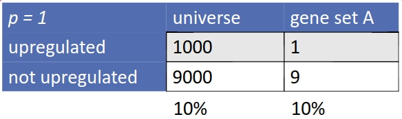
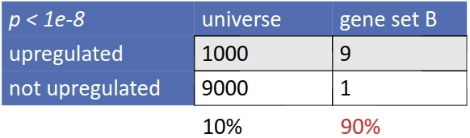

---
date: '`r glue("Document generated: {Sys.Date()}")`'
---

```{r, eval = TRUE, include = FALSE, echo = FALSE}
if (!require(emo))
  devtools::install_github("hadley/emo")
```

```{r, eval = TRUE, echo = FALSE}
HIGHLIGHT_TYPE <- "highlightjs"
```

```{r, eval = TRUE, child = "../../tooltip_child.Rmd"}
```

```{js, echo = FALSE, eval = TRUE}
$(document).ready(function () {
  var regex = new RegExp("^NOTE:\\s");
  var p_note = $("p").filter(function () {
      return regex.test($(this).text()); 
  });
  
  p_note.addClass("bg-success");
});
```

***

Copy, please, these files and directories to your personal directory:

```{bash, eval = FALSE}
cp -r /data/shared/AGE2020/Exercises/E07-RNA_seq/05_gene_set_analysis ~/AGE2020/Exercises/E07-RNA_seq
```

And switch the R working directory to the current exercise: `setwd("~/AGE2020/Exercises/E07-RNA_seq/05_gene_set_analysis")`

***

# Introduction

From our data we get a list of differentially expressed genes (DEGs), but what if:

- **There is too few DEGs?**
- **There are too many DEGs?**
- **We are not sure what is a biological meaning of found DEGs?**

The solution is Gene Set Analysis.
It allows to get biological insight at the level of biological processes, metabolic pathways, regulation by transcription factors or miRNAs, etc.

The fundamental concept of Gene Set Analysis is testing gene sets rather than single genes.
Gene set is a group of genes involved in a specific biological process or pathway.
We can test if genes from our experiment are over-represented in such gene set and
conclude if, e.g. pathway, is regulated.

***

# Data preparation

We will use our saved results from the differential expression tutorial.

```{r}
library(DESeq2)
library(magrittr)
library(glue)
library(ggplot2)

load("../04_differential_expression/04_differential_expression.RData")
```

***

# Databases

There are many databases which provide gene sets.
Some of them are very coarse (GO terms), whereas some provide finer gene sets on
level of individual pathways (KEGG, Reactome).

- **Gene ontology**

  [Gene ontology](http://geneontology.org/) has three main groups (trees) of terms:
  
  - Biological Process (BP)
  - Molecular Function (MF)
  - Cellular Component (CC)
  
  Very nice database of GO terms is [AmiGO 2](http://amigo.geneontology.org/amigo).

- **KEGG: Kyoto Encyclopedia of Genes and Genomes**

  [KEGG](https://www.kegg.jp/) is a database resource for understanding high-level functions and utilities of the biological system,
  such as the cell, the organism and the ecosystem, from molecular-level information, especially large-scale
  molecular datasets generated by genome sequencing and other high-throughput experimental technologies.

- **Reactome**

  [Reactome](https://reactome.org/) is an open-source, open access, manually curated and peer-reviewed pathway database.

- **MSigDB**

  The Molecular Signatures Database ([MSigDB](https://www.gsea-msigdb.org/gsea/msigdb/index.jsp)) is a collection of annotated gene sets.
  There are gene sets such as hallmark, curated disease gene sets, KEGG, GO, Reactome and many more.

***

# Over-representation analysis (ORA)

This is the most basic test of gene set enrichment.
We are testing whether [odds ratio](https://en.wikipedia.org/wiki/Odds_ratio) in 2x2 contingency table is different from 1,
using the [Fisher's exact test](https://en.wikipedia.org/wiki/Fisher%27s_exact_test).
So the null hypothesis is

$$H_0: \frac{(up/notup)_{universe}}{(up/notup)_{geneset}} = 1$$



<hr />



<hr />

## `goseq`

From [Matthew D Young et al., 2010](https://genomebiology.biomedcentral.com/articles/10.1186/gb-2010-11-2-r14)
([`goseq`](https://bioconductor.org/packages/release/bioc/html/goseq.html)) paper:

In RNA-seq experiments the expression level of a transcript is estimated from the number of reads that map to that transcript.
But longer transcripts are yielding more reads, and thus longer transcripts give more statistical power for detecting differential expression between samples.
Similarly, more highly expressed transcripts have a greater number of reads and greater power to detect differential expression.


In ORA, it is assumed that all genes are independent and equally likely to be selected as DE, under the null hypothesis.
It is this assumption that makes the standard GO analysis methods unsuitable for RNA-seq data due to the bias in detecting
differential expression for genes with a high number of reads.
It follows then that when using a standard analysis, any category containing a preponderance of long genes will be more
likely to show up as over-represented than a category with genes of average length.
Similarly, categories with highly expressed genes are also more likely to be found as over-represented than categories of lowly expressed genes.
Having identified this issue, it is possible to compensate for the effect of selection bias
in the statistical test of a category's enrichment among differentially expressed genes.

So what `goseq` does is that during ORA it accounts for a bias in length of transcripts.

As an input, `goseq` needs a named vector:

- **Names = IDs of measured genes**. All genes for which RNA-seq data was gathered for your experiment.
   Each element of your vector should be named by a unique gene identifier.
- **Values = 0/1 indicating DE status**. Each element of your vector should be either a 1 or a 0,
   where 1 indicates that the gene is differentially expressed and 0 that it is not.

We will get this named vector from `DESeq2` results.
We reuse the boolean vector we used before for filtering DEGs from the results table (`res_dex_shrink`):

```{r}
genes <- ifelse(deg_filter, 1, 0)
names(genes) <- rownames(res_dex_shrink)
head(genes)
```

If organism in your experiment isn't something unusual, `goseq` will provide all the necessary
information (genes in GO terms, gene lengths, etc.).
To show available databases:

```{r, message = FALSE}
library(goseq)
supportedOrganisms()
```

We can see that data for our reference genome (hg19, ensGene) are available.

First we calculate a Probability Weighting Function (PWF).
The PWF quantifies how the probability of a gene selected as DE changes as a function of its transcript length.

```{r}
pwf <- nullp(genes, genome = "hg19", id = "ensGene")
```

The proportion of DE genes is plotted as a function of the transcript length.
The green line is the probability weighting function.
A clear trend towards more detected differential expression at longer gene lengths can be seen.

Having the PWF, we can now test GO terms enrichment:

```{r}
goseq_go_results <- goseq(pwf, genome = "hg19", id = "ensGene")
head(goseq_go_results)
```

GO terms are sorted by over-representation p-values.
You can see the size of GO term (`numInCat`) and number of DEGs in that term (`numDEInCat`).

You can also test KEGG pathways enrichment:

```{r}
goseq_kegg_results <- goseq(pwf, genome = "hg19", id = "ensGene", test.cats = "KEGG")
head(goseq_kegg_results)
```

But you can see that the annotation for KEGG is not very good.
Values in column `category` are KEGG IDs.
For example, `00750` is pathway [hsa00750](https://www.genome.jp/dbget-bin/www_bget?pathway+hsa00750).

## Using custom length and GO data

If you don't find your genome in `supportedOrganisms()`, you can quite easily make your own data.

For length data, you need to prepare a numeric vector of the same length as the input vector with
gene names and DE status.
You can use a corresponding `TxDb` of your genome, as we did for calculating TPM in the exercise `03_exploratory_analysis`,
and get a list of median transcript lengths of each gene:

```{r, eval = FALSE}
library(GenomicFeatures)
txdb <- makeTxDbFromGFF("../_data/genome/Homo_sapiens.GRCh37.75.gtf", format = "gtf")
txs_by_gene <- transcriptsBy(txdb, "gene")
length_data <- median(width(txs_by_gene))
```

For GO data you need to provide dataframe with two columns: gene ID (ENSEMBL) and GO category.
You can use annotation packages, such as `org.Hs.eg.db` for human:

```{r, eval = FALSE}
library(org.Hs.eg.db)
# This will return more columns than we specified.
go_ann <- AnnotationDbi::select(org.Hs.eg.db, keys = keys(org.Hs.eg.db), columns = c("ENSEMBL", "GOALL")) %>%
  dplyr::select(ENSEMBL, GOALL)
```

We obtained only GO term IDs, which are not very meaningful.
However, we can use `clusterProfiler::go2term(go_ann$GOALL)` to retrieve GO term descriptions.

# Gene Set Enrichment Analysis (Subramanian) on KEGG

This method is the original Gene Set Enrichment Analysis
([Subramanian's paper](https://www.pnas.org/content/102/43/15545#sec-1)).
In contrast with ORA, GSEA takes into account all relevant genes and their order.
The principle is simple:

- We have a list L with all genes, sorted by t-statistic.
- We have a list S with genes of our interest (gene set).
- Iterate through the list L and:
    - If gene is in the list S, increase a running-sum statistic.
      The magnitude of the increment depends on the t-statistic.
    - If gene is not in the list S, decrease a running-sum statistic.
- An Enrichment Score (ES) is the maximum deviation from zero encountered in the random walk.
- A Normalized Enrichment Score (NES) accounts for gene set size and can be used to compare
  analysis results across different gene sets.
- A Leading-Edge Subset is the core of a gene set that accounts for the enrichment signal.
  High scoring gene sets can be grouped on the basis of leading-edge subsets of genes that they share.
  Such groupings can reveal which of those gene sets correspond to the same biological processes
  and which represent distinct processes.

](_rmd_images/gsea.jpg)

We will use [`clusterProfiler`](https://bioconductor.org/packages/release/bioc/html/clusterProfiler.html)
which offers updated gene sets for most of the popular databases (GO, KEGG, Reactome, etc.).
`clusterProfiler` can do both ORA and GSEA, but for ORA is better `goseq` due to the correction of gene length bias.

There is a nice [overview](https://bioconductor.org/packages/release/bioc/vignettes/clusterProfiler/inst/doc/clusterProfiler.html)
of `clusterProfiler` abilities, and also a more detailed [book](https://yulab-smu.github.io/clusterProfiler-book/index.html),
where you can also find guides how to use more "exotic" gene set sources.

There are already implemented functions for GO, KEGG and some disease-related gene set sources.
For custom gene sets, you have to use generic functions `GSEA()` and `enricher()`.

Besides gene set analysis, `clusterProfiler` can also convert between gene IDs with
[`bitr()`](https://yulab-smu.github.io/clusterProfiler-book/chapter14.html#bitr)
function, for example `bitr(vector_of_gene_symbols, fromType = "SYMBOL", toType = "ENTREZID", OrgDb = "org.Hs.eg.db")`.
That is quite useful :)

You can find other useful functions [here](https://guangchuangyu.github.io/software/clusterProfiler/).
They are mainly for manipulation and filtering of GO terms.

](_rmd_images/clusterProfiler_diagram.png)

`clusterProfiler` needs a named vector where names are ENTREZIDs and values are some statistics, which can be used to sort this vector.
In our case of RNA-seq data processed by `DESeq2`, we will use the Wald statistics, which are computed as `log2FoldChange / lfcSE`
and which we have in column `stat` in `res_dex`.
However, Wald statistics are missing in our shrunken results table (`res_dex_shrink`), but we can simply calculate them:

```{r}
res_dex_shrink$stat <- res_dex_shrink$log2FoldChange / res_dex_shrink$lfcSE
```

Next problem is that IDs of our genes are ENSEMBL IDs, but `clusterProfiler` needs ENTREZIDs.
No worries, the `bitr()` function will help us.

```{r}
library(clusterProfiler)
```

```{r, message = TRUE}
entrez_ids <- bitr(rownames(res_dex_shrink), fromType = "ENSEMBL", toType = "ENTREZID", OrgDb = "org.Hs.eg.db")
head(entrez_ids)
any(duplicated(entrez_ids$ENSEMBL))
any(duplicated(entrez_ids$ENTREZID))
```

There are always problems when you are converting gene IDs.
Generally, you lost some genes, because they don't have the other gene ID,
or oppositely you obtain duplicates.

We will remove duplicated ENTREZIDs, add ENTREZIDs to `res_dex_shrink`,
remove duplicatedcreate a named vector where names are ENTREZIDs
and values are Wald statistics, and sort it in decreasing order:

```{r}
entrez_ids <- entrez_ids[!duplicated(entrez_ids$ENTREZID), ]

res_dex_shrink <- res_dex_shrink %>%
  as.data.frame() %>%
  dplyr::mutate(ENSEMBL = rownames(.)) %>%
  dplyr::left_join(entrez_ids, by = "ENSEMBL") %>%
  dplyr::filter(!is.na(ENTREZID)) %>%
  magrittr::set_rownames(.$ENTREZID)

entrez_wald <- res_dex_shrink$stat
names(entrez_wald) <- res_dex_shrink$ENTREZID

# Sort by decreasing Wald statistic.
entrez_wald <- entrez_wald[order(entrez_wald, decreasing = TRUE)]
```

Similarly we prepare a named vector of LFCs:

```{r}
entrez_lfc <- res_dex_shrink$log2FoldChange
names(entrez_lfc) <- res_dex_shrink$ENTREZID
entrez_lfc <- entrez_lfc[order(entrez_lfc, decreasing = TRUE)]
```

So this is our list L:

```{r}
head(entrez_wald)
```

Let's run GSEA on KEGG pathways:

```{r, message = TRUE, warning = TRUE}
gsea_kegg_results <- gseKEGG(
  geneList = entrez_wald,
  # KEGG organism ID
  organism = "hsa",
  # Key type is ENTREZ ID.
  keyType = "ncbi-geneid",
  # Run 10 000 permutation tests for each pathway.
  nPerm = 10000,
  # Correct p-values for FDR.
  pAdjustMethod = "fdr",
  # FDR adjusted p-value threshold.
  # We are OK with 10% of false positives among all pathways called significant.
  pvalueCutoff = 0.1,
  verbose = TRUE
)

as.data.frame(gsea_kegg_results)
```

- **leading_edge**:
  - **Tags** indicates the percentage of genes contributing to the enrichment score.
  - **List** indicates where in the list the enrichment score is attained.
  - **Signal** indicates enrichment signal strength.
- **core_enrichment**: genes in leading-edge subset.

Now we can visualize our results.
First we will convert ENTREZIDs back to SYMBOLs.

```{r}
gsea_kegg_results <- setReadable(gsea_kegg_results, "org.Hs.eg.db", keyType = "ENTREZID")
```

## GSEA plot

We can plot a classic GSEA plot (like in the original paper) for first three pathways
with the highest enrichment score:

```{r}
library(enrichplot)

gseaplot2(gsea_kegg_results, geneSetID = 1:3, pvalue_table = TRUE, ES_geom = "dot")
```

## Dotplot

Dotplot shows how leading edge genes are distributed.

- **GeneRatio**: ratio of top scoring genes in gene set.
- **Count**: number of top scoring genes in gene set.

```{r}
dotplot(gsea_kegg_results, showCategory = 15, x = "GeneRatio", font.size = 10)
```

## Gene-Concept Network

The `cnetplot()` function depicts the linkages of genes and biological concepts (e.g. GO terms or KEGG pathways) as a network.
Because it won't fit inside the RMarkdown document, we will save it as a PNG file.

```{r}
# cnetplot returns a ggplot2 object
p <- cnetplot(gsea_kegg_results, showCategory = 3, foldChange = entrez_lfc, colorEdge = TRUE)
ggsave("gsea_cnetplot.png", p, device = "png", width = 10, height = 10)
```

[gsea_cnetplot.png](gsea_cnetplot.png)

## Gene-Concept Network in heatmap

We can also show the Gene-Concept Network in a heatmap.

```{r}
p <- heatplot(gsea_kegg_results, foldChange = entrez_lfc, showCategory = 3) +
  theme(axis.text.x = element_text(angle = 90, vjust = 2, size = 7))
ggsave("gsea_heatmap.png", p, device = "png", width = 15, height = 5)
```

[gsea_heatmap.png](gsea_heatmap.png)

## Enrichment map

Enrichment map organizes enriched terms into a network with edges connecting overlapping gene sets.
In this way, mutually overlapping gene sets are tend to cluster together, making it easy to identify functional module.

```{r}
emapplot(gsea_kegg_results, color = "NES")
```

## PubMed Central plot

One of the problem of enrichment analysis is to find pathways for further investigation.
The `pmcplot()` function plots the number/proportion of publications trend based on the query result from PubMed Central.
All text that can be queried on PMC is valid as input of `pmcplot()`.

```{r, fig.width = 10, fig.height = 5}
terms <- gsea_kegg_results$Description[1:3]
p <- pmcplot(terms, 2010:2017)
p2 <- pmcplot(terms, 2010:2017, proportion = FALSE)
cowplot::plot_grid(p, p2, ncol = 2)
```

***

# Gene Set Enrichment Analysis (Subramanian) on Reactome

For Reactome you can use package [`ReactomePA`](https://bioconductor.org/packages/release/bioc/html/ReactomePA.html)
from the same author as `clusterProfiler`.
The function for GSEA is `gsePathway()` and uses parameters similar to `gseKEGG()`.

**This is your homework.**

***

# Gene Set Enrichment Analysis (Subramanian) on MSigDB

For MSigDB, you have to first get a gene sets of interest.
This is nicely described [here](https://yulab-smu.github.io/clusterProfiler-book/chapter3.html#msigdb-analysis).

So go to MSigDB webpage, find some interesting gene set and perform GSEA. **This is your homework.**

***

# Signaling pathway impact analysis (SPIA)

`SPIA` tries to estimate the effect on a pathway, which must be curated and influence of
a change in gene expression on the pathway output is known.
It uses [KEGG](https://www.genome.jp/kegg/) curated signaling pathways.

`SPIA` calculates two statistics:

- **Over-representation** (ORA) of DEGs in the pathway.
- **Perturbation** (PERT): the influence of observed expression changes on pathway output.

Significant pathways will have both ORA and PERT high.

To use the [`SPIA`](https://bioconductor.org/packages/release/bioc/html/SPIA.html) package,
you need to preprocess KGML files defining the KEGG pathways.
KGML is a special XML format describing members of a pathway and their connections and influence.
Those files can be downloaded from KEGG page
([example](https://www.genome.jp/kegg-bin/show_pathway?map=hsa04110&show_description=show)).

Then KGML files need to be prepared for `SPIA`, simply by included function which will
save processed data in `.RDs` format.
We have already downloaded some KGML files (top 5 from GSEA), so let's prepare them for SPIA:

```{r}
library(SPIA)

makeSPIAdata(
  kgml.path = "kegg_data",
  organism = "hsa",
  out.path = "kegg_data"
)
```

As for `clusterProfiler`, `SPIA` needs a named vector.
But instead of t-statistics, it needs LFCs od DEGs.
Let's prepare it:

```{r}
# ENTREZIDs of DEGs
deg_entrezids <- res_dex_shrink[deg_filter, "ENTREZID"]
# Vector of LFCs of DEGs. Names are ENTREZIDs.
entrez_lfc_deg <- entrez_lfc[deg_entrezids]
entrez_lfc_deg <- entrez_lfc_deg[order(entrez_lfc_deg, decreasing = TRUE)]
head(entrez_lfc_deg)
```

Now let's run `SPIA`:

```{r}
spia_results <- spia(
  de = entrez_lfc_deg,
  all = res_dex_shrink$ENTREZID,
  organism = "hsa",
  data.dir = "kegg_data/"
)

spia_results
```

We got a dataframe with several columns:

- **pSize**: number of genes in the pathway.
- **NDE**: the number of DE genes per pathway.
- **tA**: the observed total perturbation accumulation in the pathway.
- **pNDE**: the probability to observe at least NDE genes on the pathway using a hypergeometric model.
- **pPERT**: the probability to observe a total accumulation more extreme than tA only by chance.
- **pG**: the p-value obtained by combining pNDE and pPERT.
- **pGFdr** and **pGFWER**: the False Discovery Rate and respectively Bonferroni adjusted global p-values.
- **Status**: gives the direction in which the pathway is perturbed (activated or inhibited).
- **KEGGLINK**: gives a web link to the KEGG website that displays the pathway image with the differentially expressed genes highlighted in red.

Now we will look at the two-evidence plot:

```{r}
plotP(spia_results, threshold = 0.3)
```

- The horizontal axis represents the p-value (minus log of) corresponding to the probability of obtaining at
  least the observed number of genes (NDE) on the given pathway just by chance.
- The vertical axis represents the p-value (minus log of) corresponding to the probability
  of obtaining the observed total accumulation (tA) or more extreme on the given pathway just by chance.
- The pathways at the right of the red oblique line are significant after Bonferroni correction of
  the global p-values (pG), obtained by combining the pPERT and pNDE using Fisher's method.
- The pathways at the right of the blue oblique line are significant after a FDR correction of the global p-values (pG).

***

# Viewing data in KEGG

[`Pathview`](https://bioconductor.org/packages/release/bioc/html/pathview.html) is a great
package for viewing colorized KEGG pathways.
It can download KGML files and store them for later.

```{r}
library(pathview)

pathview(
  # LFC to color pathway.
  gene.data = entrez_lfc_deg,
  # We use top pathway by ES from GSEA.
  pathway.id = gsea_kegg_results$ID[1],
  species = "hsa",
  # Coloring range <min LFC; max LFC>
  limit = list(gene = max(abs(entrez_lfc_deg)), cpd = 1),
  kegg.dir = "kegg_data/"
)
```

<a href="`r glue('{gsea_kegg_results$ID[1]}.pathview.png')`" target="_blank">`r glue('{gsea_kegg_results$ID[1]}.pathview.png')`</a>

# Online tools

These are some online tools for GSEA (ORA):

- [g:Profiler](https://biit.cs.ut.ee/gprofiler/gost)
- [Enrichr](http://amp.pharm.mssm.edu/Enrichr/)
- [WEB-based GEne SeT AnaLysis Toolkit](http://www.webgestalt.org/)
- [DAVID](https://david.ncifcrf.gov/)
- [Reactome](https://www.reactome.org/)

***

# Finishing up

It's a good practice to include all warnings (`warnings()`) and errors (`traceback()`), and also information
about your environment - R version, libraries, etc. (`sessionInfo()`) - on the end of your script.
We also save our current variables to a single file from which we can later restore them.

```{r, eval = TRUE}
save.image("05_gene_set_analysis.RData")

warnings()
traceback()
sessionInfo()
```

***

# HTML rendering

This chunk is not evaluated (`eval = FALSE`). Otherwise you will probably end up in recursive hell `r emo::ji("exploding_head")`

```{r, eval = FALSE, message = FALSE, warning = FALSE}
library(rmarkdown)
library(knitr)
library(glue)

# You can set global chunk options. Options set in individual chunks will override this.
opts_chunk$set(warning = FALSE, message = FALSE)
render("05_gene_set_analysis.Rmd", output_file = "05_gene_set_analysis.html")
```
